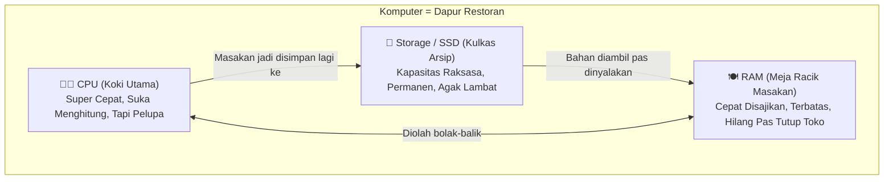

# 📖 KITAB BELAJAR MANDIRI CYBER SECURITY: DARI AWAM JADI PAHAM
### *Buku Pegangan Otodidak untuk Pemula Mutlak — Tanpa Mentor, Langsung Praktik!*
> **Penyusun:** Divisi Edukasi UKM Cyber Security (Cysec)  
> **Edisi:** 1.0 (Panduan Mandiri)  
> **Prinsip Utama:** *"Keamanan siber itu bukan sihir atau matematika dewa. 80% adalah logika kewaspadaan dan kebiasaan sehari-hari."*

---

## 🧭 Cara Menggunakan Buku Ini
Buku ini dibuat khusus buat lu yang **nggak punya latar belakang IT sama sekali**, belajar sendirian di kamar, tapi punya rasa penasaran tinggi. 

**3 Aturan Emas Belajar Mandiri:**
1. **Jangan Cuma Dibaca, Wajib Dipraktikkan:** Buka laptop lu, ketik sendiri perintahnya. Jari lu butuh mengingat letak tombolnya.
2. **Error Itu Sahabat Terbaik, Bukan Tanda Lu Bodoh:** Kalau muncul tulisan merah atau error di layar, selamat! Lu baru aja nemu satu hal yang nggak boleh dilakuin. Baca pesan errornya pelan-pelan.
3. **Tonton Video yang Disertakan:** Kalau mata lu capek baca teks, langsung klik tautan video referensi yang sudah dikurasi di setiap bab.

---

# 📑 DAFTAR ISI
1. [BAB 1: Anatomi Komputer dari Kacamata Hacker](#bab-1-anatomi-komputer-dari-kacamata-hacker)
2. [BAB 2: Survival Kit Terminal Linux (Taklukkan Layar Hitam)](#bab-2-survival-kit-terminal-linux-taklukkan-layar-hitam)
3. [BAB 3: Wargame Mandiri: OverTheWire Bandit (Level 0 – 10)](#bab-3-wargame-mandiri-overthewire-bandit-level-0--10)
4. [BAB 4: Fondasi Jaringan Internet: Kurir & Jalan Tol](#bab-4-fondasi-jaringan-internet-kurir--jalan-tol)
5. [BAB 5: Personal Cyber Hygiene (Mengamankan Diri Sendiri)](#bab-5-personal-cyber-hygiene-mengamankan-diri-sendiri)
6. [BAB 6: Kamus Istilah Gaul Siber](#bab-6-kamus-istilah-gaul-siber)

---

# 🍳 BAB 1: Anatomi Komputer dari Kacamata Hacker

Banyak orang awam mengira komputer itu benda mistis yang rumit. Faktanya, komputer itu persis seperti **Dapur Restoran Cepat Saji**.



### 1. CPU (Central Processing Unit) = Koki Super Cepat tapi Pelupa
* **Tugasnya:** Mengeksekusi instruksi. Dia bisa menghitung miliaran kali dalam satu detik (contoh: 3.5 GHz = 3,5 miliar operasi per detik).
* **Kelemahannya:** Koki ini nggak punya ingatan jangka panjang. Dia cuma tahu apa yang ada di depannya sekarang.
* **Celah Hacker:** Hacker suka menipu koki ini dengan "resep racun" (*Buffer Overflow / Code Injection*) agar koki menjalankan perintah jahat tanpa disadari.

### 2. RAM (Random Access Memory) = Meja Racik Masakan
* **Tugasnya:** Menampung program dan data yang **sedang aktif dibuka detik ini**.
* **Sifatnya:** Sangat cepat dijangkau koki, tapi bersifat **Volatile (Hilang saat listrik mati)**. Begitu laptop lu dimatikan, meja ini bersih seketika.
* **Kenapa Hacker Mengincar RAM?**  
  Ketika lu mengetik password akun atau PIN m-banking, aplikasi harus menaruh password aslinya di meja RAM ini sebelum diolah. Hacker yang berhasil menyusup bisa melakukan teknik **Memory Dumping** (memotret meja racik) untuk mencuri password teks polos (*plaintext*) yang belum sempat dihapus!

### 3. Storage (SSD / Harddisk) = Kulkas & Gudang Arsip
* **Tugasnya:** Menyimpan foto, file Word, game, dan sistem operasi Windows/Linux secara **Permanen**. Listrik mati pun isinya tetap aman.
* **Kacamata Hacker:** Tempat hacker menanam **Trojan** atau **Backdoor**. Tujuannya supaya begitu laptop lu dimatikan dan dinyalakan lagi besok pagi, program jahatnya otomatis bangkit kembali.

---

### 📺 Video Referensi Rekomendasi (Bab 1):
* 🇮🇩 **Kelas Terbuka:** [Cara Kerja Komputer & Komponen Dasar (Hardware)](https://www.youtube.com/results?search_query=kelas+terbuka+cara+kerja+komputer) *(Penjelasan super ramah pemula dengan animasi sederhana).*
* 🇬🇧 **CrashCourse Computer Science:** [Crash Course Computer Science Preview & Episode 1](https://www.youtube.com/watch?v=tpIctyqH29Q&list=PL8dPuuaLjXtNlUrzyH5r6jN9ulIgZBpdo) *(Animasi visual terbaik di dunia tentang bagaimana listrik berubah jadi logika komputer).*

---

# 🖥️ BAB 2: Survival Kit Terminal Linux (Taklukkan Layar Hitam)

Orang awam sering panik saat melihat layar hitam terminal tanpa mouse. Padahal:
* **Menggunakan Mouse (GUI):** Seperti memesan makanan lewat buku menu di restoran. Enak dilihat, tapi pilihannya terbatas cuma apa yang ada di gambar.
* **Menggunakan Terminal (CLI):** Seperti masuk langsung ke dapur dan bicara langsung ke kokinya. Lu bebas minta racikan apa saja yang bisa dibuat dapur itu!

---

### 🛠️ Persiapan Alat Tempur di Laptop Lu:
* **Jika Pakai Windows:** Install **Git for Windows** (akan dapat aplikasi **Git Bash**) atau aktifkan **WSL2 (Ubuntu)**.
* **Jika Pakai Mac / Linux:** Aplikasi **Terminal** sudah langsung ada dari pabrik.

---

### 📜 8 Mantra Sakti yang Wajib Dipraktikkan:

Bayangkan lu sedang menjelajah gedung kos-kosan raksasa bertingkat. Setiap folder adalah sebuah kamar.

#### 1. `pwd` (Print Working Directory)
* **Analogi:** Cek GPS atau nanya: *"Gua lagi berdiri di lantai dan kamar mana sekarang?"*
* **Contoh:** Ketik `pwd` lalu tekan ENTER. Layar akan menampilkan lokasi lu, misalnya `/c/Users/Wildan`.

#### 2. `ls` dan `ls -la` (List)
* **Analogi:** Menyalakan lampu senter buat melihat barang apa saja yang ada di kamar ini.
* **Trik Rahasia (`ls -la`):** Menyalakan senter tembus pandang sinar-X! Huruf `-a` bakal memunculkan file yang sengaja disembunyikan di kolong kasur (file yang diawali tanda titik, contoh: `.password.txt`).

#### 3. `cd` (Change Directory)
* **Analogi:** Melangkah membuka pintu kamar lain.
* Masuk kamar: `cd Documents`
* **Mundur satu langkah ke luar kamar (PENTING!):** `cd ..` *(titik dua artinya mundur satu level)*.
* Pulang ke kamar utama: `cd ~`

#### 4. `mkdir` (Make Directory) & `touch`
* `mkdir nama_folder` = Bikin kamar / map baru.
* `touch nama_file.txt` = Menaruh selembar kertas catatan kosong baru.

#### 5. `cat` (Concatenate)
* **Analogi:** Membaca selembar surat dalam sekejap tanpa repot membuka aplikasi Notepad.
* **Contoh:** `cat nama_file.txt`

#### 6. `grep` (Global Regular Expression Print)
* **Analogi:** Detektif pencari jarum di tumpukan jerami.
* **Contoh:** Lu punya dokumen 10.000 baris, lu cuma mau baris yang ada kata "admin":
  ```bash
  grep "admin" daftar_pengguna.txt
  ```

#### 7. Tombol Ajaib `TAB` di Keyboard
* **Trik Terpenting Praktisi:** Jangan pernah mengetik nama folder panjang huruf demi huruf! Ketik 2–3 huruf pertamanya, lalu tekan tombol **TAB**. Terminal akan otomatis melengkapinya sendiri. Kalau ditekan 2 kali, dia bakal ngasih contekan pilihan kata!

#### 8. Peringatan Bahaya: `rm` (Remove)
* `rm nama_file.txt` = Menghancurkan file seketika.
* ⚠️ **Ingat:** Di terminal Linux **TIDAK ADA TEMPAT SAMPAH / RECYCLE BIN!** Sekali lu hapus, barangnya musnah selamanya.

---

### 📺 Video Referensi Rekomendasi (Bab 2):
* 🇮🇩 **Dea Afrizal:** [Belajar Linux Command Line Dasar untuk Pemula](https://www.youtube.com/results?search_query=dea+afrizal+belajar+linux+dasar) *(Gaya santai, kocak, dan sangat membumi).*
* 🇬🇧 **NetworkChuck:** [You need to learn Linux RIGHT NOW!!](https://www.youtube.com/watch?v=s3ii44q4WbE) *(Sangat berenergi, visual grafisnya luar biasa, kopi selalu siap).*

---

# 🏴‍☠️ BAB 3: Wargame Mandiri: OverTheWire Bandit (Level 0 – 10)

Ini adalah game simulasi peretasan legal terbaik di dunia untuk pemula. Di setiap level, ada satu password tersembunyi yang harus lu cari untuk bisa login ke level berikutnya.

```
Kunci Level 0 ➔ Masuk Level 1 ➔ Cari Kunci Level 1 ➔ Masuk Level 2 ➔ dst...
```

---

### 🚀 Cara Mulai Koneksi (Level 0)
1. Buka terminal laptop lu.
2. Ketik perintah **SSH** ini:
   ```bash
   ssh bandit0@bandit.labs.overthewire.org -p 2220
   ```
3. Kalau ditanya `Are you sure you want to continue connecting (yes/[no])?`, ketik `yes` lalu ENTER.
4. Password Level 0: ketik `bandit0` lalu ENTER.  
   *(🚨 **Catatan Penting:** Huruf password memang sengaja disembunyikan/tidak muncul bintang di layar Linux demi keamanan. Jangan bingung, ketik saja lalu tekan ENTER!).*

---

### 🗺️ Panduan Walkthrough Terbimbing (Level 0 s.d. Level 10):

#### 🎯 Level 0 ➔ Level 1: Mengambil Surat di Meja
* **Masalah:** Password tersimpan di file `readme`.
* **Solusi Mandiri:**
  ```bash
  ls
  cat readme
  ```
* **Hasil:** Deretan karakter acak keluar di layar. Salin dan simpan di aplikasi Notepad laptop lu! Ketik `exit` untuk keluar.

#### 🎯 Level 1 ➔ Level 2: File dengan Nama Strip (`-`)
* **Masalah:** Login ke `bandit1` dengan password tadi. Password berikutnya ada di file bernama tanda strip `-`. Kalau lu ketik `cat -`, terminal bakal bingung.
* **Solusi Mandiri:** Beritahu terminal lokasi tepatnya menggunakan `./` (folder saat ini):
  ```bash
  cat ./-
  ```

#### 🎯 Level 2 ➔ Level 3: File dengan Nama Spasi
* **Masalah:** Password ada di file bernama `spaces in this filename`. Di Linux, spasi dikira pemisah perintah yang berbeda.
* **Solusi Mandiri (Pilih salah satu):**
  * Cara 1: Bungkus pakai tanda kutip: `cat "spaces in this filename"`
  * Cara 2: Ketik `cat sp` lalu tekan tombol ajaib **TAB**.

#### 🎯 Level 3 ➔ Level 4: Menemukan File yang Disembunyikan
* **Masalah:** Masuk ke folder `inhere`. Pas diketik `ls`, foldernya terlihat kosong!
* **Solusi Mandiri:** Nyalakan senter sinar-X untuk melihat file tersembunyi:
  ```bash
  cd inhere
  ls -la
  cat .hidden
  ```

#### 🎯 Level 4 ➔ Level 5: Mencari Jarum File Teks di Gudang Sampah
* **Masalah:** Di dalam folder `inhere` ada banyak file acak (`-file00` s.d. `-file09`). Semuanya kode biner berantakan, cuma ada satu yang berupa teks yang bisa dibaca manusia (*human-readable*).
* **Solusi Mandiri:** Gunakan mantra pendeteksi jenis barang `file`:
  ```bash
  cd inhere
  file ./*
  ```
  Cari yang keterangannya bertuliskan **ASCII text**, lalu baca file tersebut menggunakan `cat`.

#### 🎯 Level 5 ➔ Level 6: Mencari File Berdasarkan Kriteria Spesifik
* **Masalah:** Password ada di suatu tempat di folder `inhere` yang punya banyak sekali sub-folder bertingkat. Petunjuknya:
  1. Ukuran filenya tepat **1033 bytes**.
  2. Tidak bisa dieksekusi (bukan aplikasi).
  3. Bisa dibaca manusia (*human-readable*).
* **Solusi Mandiri:** Gunakan mantra pelacak `find`:
  ```bash
  find . -type f -size 1033c ! -executable
  ```
  Lalu baca file hasil pencarian tersebut dengan `cat`.

#### 🎯 Level 6 ➔ Level 7: Mencari File di Seluruh Penjuru Server
* **Masalah:** File password ada di suatu tempat di komputer server dengan kriteria:
  * Pemiliknya user `bandit7`
  * Grupnya `bandit6`
  * Ukurannya `33 bytes`
* **Solusi Mandiri:**
  ```bash
  find / -user bandit7 -group bandit6 -size 33c 2>/dev/null
  ```
  *(💡 Catatan: Kode `2>/dev/null` di belakang artinya: "Tolong sembunyikan semua pesan error permission denied yang bikin layar penuh sampah!").*

#### 🎯 Level 7 ➔ Level 8: Mencari Kata di Kamus Raksasa
* **Masalah:** Password ada di file `data.txt` persis di samping kata `millionth`. Tapi file itu panjangnya ribuan baris!
* **Solusi Mandiri:** Pakai detektif `grep`:
  ```bash
  grep "millionth" data.txt
  ```

#### 🎯 Level 8 ➔ Level 9: Mencari Baris yang Tidak Punya Kembaran
* **Masalah:** File `data.txt` berisi ribuan baris teks yang berulang-ulang, hanya ada **satu baris unik** yang tidak punya duplikat sama sekali.
* **Solusi Mandiri:** Urutkan dulu datanya (`sort`), lalu ambil yang unik (`uniq -u`):
  ```bash
  sort data.txt | uniq -u
  ```

#### 🎯 Level 9 ➔ Level 10: Mengintip Teks di File Rusak / Biner
* **Masalah:** File `data.txt` adalah file biner acak, tapi di dalamnya ada teks manusia yang diawali banyak tanda sama dengan (`===`).
* **Solusi Mandiri:** Gunakan mantra `strings` untuk menyaring teks yang terbaca manusia:
  ```bash
  strings data.txt | grep "==="
  ```

#### 🎯 Level 10 ➔ Level 11: Membaca Surat Bersandi Base64
* **Masalah:** File `data.txt` berisi data yang disandikan dengan format Base64 (bukan enkripsi rahasia, melainkan cara komputer mengemas data teks).
* **Solusi Mandiri:** Buka bungkusnya dengan parameter `-d` (decode):
  ```bash
  base64 -d data.txt
  ```

---

### 📺 Video Referensi Rekomendasi (Bab 3):
* 🇬🇧 **John Hammond:** [OverTheWire Bandit Walkthrough (Complete Series)](https://www.youtube.com/watch?v=lvyhhv4zGg4&list=PL1H1sBF1VAKVMnOsnne8_lS1QW0f_tL3H) *(Salah satu edukator siber terbaik di dunia. Tonton kalau lu benar-benar buntu!).*

---

# 🌐 BAB 4: Fondasi Jaringan Internet: Kurir & Jalan Tol

Internet itu bukan keajaiban udara gaib. Internet adalah **jutaan komputer yang saling terhubung lewat kabel tembaga dan serat optik bawah laut.**

### Analogi Jalan Raya:
* **IP Address (contoh: `192.168.1.5`):** Alamat fisik rumah lu. Agar paket belanja online tahu harus dikirim ke rumah mana.
* **Port (contoh: Port `80`, Port `443`, Port `22`):** Nomor pintu kamar kos spesifik di rumah itu.
  * Pintu 80: Pintu ruang tamu untuk web biasa (HTTP).
  * Pintu 443: Pintu brankas untuk web aman (HTTPS).
  * Pintu 22: Pintu gerbang samping khusus admin (SSH).
* **DNS (Domain Name System):** Buku telepon digital raksasa. Manusia susah menghafal angka `142.250.190.46`, tapi gampang mengingat `google.com`. DNS yang menerjemahkan nama jadi angka IP.

---

### Perbedaan HTTP vs HTTPS: Kenapa WiFi Kafe Berbahaya?
* **HTTP (Biasa):** Lu mengirim surat lewat kurir **tanpa amplop**. Siapa pun yang duduk di kafe dan menyalakan laptop bisa membaca surat lu secara telanjang.
* **HTTPS (Aman / Gembok Hijau):** Surat lu dimasukkan ke dalam **brankas mini baja dengan gembok kombinasi khusus**. Kurir cuma melihat kotak hitam terkunci; hanya server bank/Google tujuan yang punya kunci untuk membukanya.

---

### 📺 Video Referensi Rekomendasi (Bab 4):
* 🇮🇩 **Web Programming UNPAS (Sandhika Galih):** [Bagaimana Internet Bekerja?](https://www.youtube.com/results?search_query=sandhika+galih+bagaimana+internet+bekerja) *(Penjelasan animasi super jernih dalam bahasa Indonesia).*
* 🇬🇧 **NetworkChuck:** [What is TCP/IP?](https://www.youtube.com/watch?v=PpsEaqJV_A3) & [Wireshark Tutorial for Beginners](https://www.youtube.com/watch?v=lb1Dw0elw0Q) *(Praktek langsung cara ngintip paket data di udara).*

---

# 🛡️ BAB 5: Personal Cyber Hygiene (Benteng Diri Sendiri)

Sebelum belajar membela kampus atau perusahaan, selamatkan diri lu sendiri dulu dengan 3 pilar ini:

### 1. Mitos Password Rumit vs Passphrase Panjang
* ❌ **Password Salah:** `P@$$w0rd1!`  
  * Terlihat rumit bagi manusia, tapi komputer hacker bisa menebaknya dalam hitungan **detik** karena polanya pendek dan sudah ada di kamus tebakan hacker.
* ✅ **Passphrase Juara:** `kucing-makan-rendang-pedas-2026`  
  * Terdiri dari 4 kata acak berbahasa Indonesia. Manusia sangat mudah mengingatnya, tapi superkomputer hacker butuh waktu **jutaan tahun** untuk menebak variasinya!

### 2. Gunakan Password Manager (Jangan Catat di Buku/Notes HP!)
Gunakan aplikasi brankas terenkripsi gratis seperti **Bitwarden**. Lu cuma perlu mengingat 1 password utama yang super kuat, sisanya biarkan aplikasi yang membuatkan password acak 20 karakter untuk setiap akun lu.

### 3. Dua Langkah Verifikasi (2FA): Jangan Pakai SMS!
SMS OTP itu rawan disadap lewat teknik *SIM Swap* (penipu menggandakan kartu SIM lu di gerai operator). Selalu pilih 2FA berbasis aplikasi seperti **Google Authenticator**, **Microsoft Authenticator**, atau **Aegis**.

---

### 📺 Video Referensi Rekomendasi (Bab 5):
* 🇮🇩 **Kementerian Kominfo / Siber Patroli:** [Waspada Modus Penipuan Undangan APK di WhatsApp](https://www.youtube.com/results?search_query=modus+penipuan+apk+whatsapp) *(Analisis kasus nyata).*
* 🇬🇧 **Veritasium:** [The Mathematical Reason Passwords Are So Bad](https://www.youtube.com/watch?v=aEmF3Icv6x4) *(Kenapa matematika membuktikan passphrase lebih kuat dari password acak pendek).*

---

# 📚 BAB 6: Kamus Istilah Gaul Siber (Cheatsheet)

| Istilah Keren | Terjemahan Bahasa Santai |
| :--- | :--- |
| **Phishing** | Memancing korban pakai umpan link/pesan palsu biar nyerahin password sendiri. |
| **Social Engineering** | Trik hipnotis/manipulasi psikologis untuk menipu pemilik akun. |
| **Brute Force** | Maling yang nyoba masukin 10.000 kunci secara membabi buta sampai ada yang pas. |
| **Malware** | Sebutan umum untuk semua software jahat (virus, trojan, spyware, ransomware). |
| **Ransomware** | Maling yang menggembok lemari lu, terus minta uang tebusan kalau mau dibukain. |
| **Firewall** | Satpam komplek yang menyeleksi siapa yang boleh masuk gerbang. |
| **VPN** | Terowongan aspal bawah tanah pribadi yang anti intip orang luar. |
| **Capture The Flag (CTF)**| Lomba tebak-tebakan dan memecahkan teka-teki keamanan siber buat melatih skill. |

---

> 🚀 *"Selamat belajar mandiri! Kalau lu tamat membaca buku ini dan berhasil menyelesaikan Bandit Level 0–10, lu sudah melangkah lebih jauh daripada 90% pengguna komputer biasa di dunia!"*

