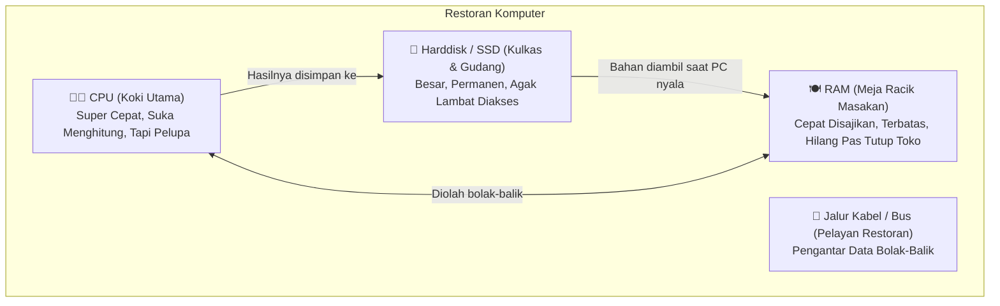

# Modul Pertemuan 1: Anatomi Komputer & Menaklukkan Ketakutan Layar Hitam (Terminal)
---

## 🎙️ Kata Pembuka dari Mentor
> *"Halo temen-temen anggota baru UKM Cysec! Selamat datang di dunia keamanan siber.*  
> *Kalau hari ini lu masih ngerasa asing banget sama komputer, masih bingung bedanya RAM sama memori internal HP, atau gemeteran tiap kali ngelihat layar hitam terminal... **tenang, lu berada di tempat yang bener-bener tepat!***  
>  
> *Di UKM ini, lu nggak dituntut jadi jenius matematika atau programmer dewa. Keamanan siber itu 80% adalah soal **kepekaan logika dan kebiasaan sehari-hari**. Hari ini kita bakal kupas tuntas rahasia jeroan komputer dan menaklukkan ketakutan terbesar orang awam: **Layar Hitam Terminal!** Yuk kita bedah pelan-pelan sambil ngopi santai."*

---

# 📑 DAFTAR ISI
1. [Jam 1: Anatomi Komputer dari Kacamata Hacker (Analogi Restoran)](#jam-1-anatomi-komputer-dari-kacamata-hacker-analogi-restoran)
2. [Jam 1.5: Membongkar Mitos Layar Hitam (Kenapa Hacker Pakai Terminal?)](#jam-15-membongkar-mitos-layar-hitam-kenapa-hacker-pakai-terminal)
3. [Jam 2: Kamus Mantra Sakti Linux (Panduan Praktik Hands-On)](#jam-2-kamus-mantra-sakti-linux-panduan-praktik-hands-on)
4. [Jam 3: Misi Tempur Pertama: Game OverTheWire Bandit (Level 0 - Level 5)](#jam-3-misi-tempur-pertama-game-overthewire-bandit-level-0---level-5)
5. [Refleksi & Rangkuman Mantra](#refleksi--rangkuman-mantra)

---

# 🍳 JAM 1: Anatomi Komputer dari Kacamata Hacker (Analogi Restoran)

Bayangin komputer atau laptop lu itu sebenarnya adalah **sebuah Restoran Masakan Padang / Kafe Cepat Saji**. Di dalam restoran itu ada 4 komponen utama:



### 1. CPU (Central Processing Unit) = Koki Utama yang Sangat Jenius Tapi Pelupa
* **Fungsinya:** Melakukan semua perhitungan dan menjalankan perintah. Otak dari komputer.
* **Sifatnya:** Si Koki bisa memotong bawang 3 miliar kali dalam satu detik (makanya ada istilah 3 GHz / GigaHertz). Tapi koki ini pelupa, dia cuma fokus sama makanan yang ada persis di depan matanya saat itu juga.
* **Kacamata Hacker:** Hacker berusaha bikin koki ini sibuk setengah mati sampai restorannya macet total (*Denial of Service / DoS*), atau menipu koki ini supaya mengeksekusi resep racun yang diselipkan tamu.

### 2. RAM (Random Access Memory) = Meja Racik Masakan
* **Fungsinya:** Tempat menaruh bahan makanan dan resep yang **sedang aktif dimasak**.
* **Sifatnya:** Sangat cepat dijangkau oleh si Koki CPU. Tapi sifatnya **Volatile (Mudah Hilang)**. Begitu restoran tutup (laptop dimatikan/restart), meja racik ini dibersihkan total sampai kosong melompong.
* **Kacamata Hacker:** **RAM ADALAH TAMBANG EMAS HACKER!** Kenapa? Karena saat lu mengetik password akun, membuka file rahasia, atau login m-banking, data aslinya sedang duduk manis di atas meja RAM dalam bentuk teks terbuka sebelum diacak. Hacker punya teknik yang namanya *Memory Dumping* untuk mencuri resep rahasia langsung dari atas meja ini.

### 3. Storage (SSD / Harddisk) = Kulkas Besar & Gudang Arsip
* **Fungsinya:** Tempat menyimpan semua file foto, dokumen, game, dan sistem operasi Windows/Linux secara **Permanen**.
* **Sifatnya:** Kapasitasnya raksasa (512 GB, 1 TB), tapi kalau koki mau ambil barang ke gudang, butuh waktu jalan kaki agak lama dibanding meja racik. Begitu listrik mati, isi kulkas tetap aman dan tidak hilang.
* **Kacamata Hacker:** Tempat favorit hacker menanam **Trojan** atau **Backdoor** (pintu belakang tersembunyi). Tujuannya agar saat laptop dimatikan lalu dinyalakan lagi besok pagi, program jahat hacker tetap hidup dan otomatis berjalan lagi.

### 4. Sistem Operasi (Windows, Linux, MacOS) = Manajer Restoran
* Dia yang mengatur lalu lintas: kapan koki harus masak, meja mana yang boleh dipakai aplikasi Spotify, dan file mana yang boleh dibuka oleh user.

---

# 🖥️ JAM 1.5: Membongkar Mitos Layar Hitam (Kenapa Hacker Pakai Terminal?)

Di film-film Hollywood, hacker selalu digambarkan duduk di ruangan gelap, ngetik di layar hitam dengan teks hijau yang mengalir kencang tanpa menyentuh mouse sama sekali. 

Apakah itu beneran? **Iya, tapi bukan sulap atau sihir!**

```
GUI (Graphical User Interface)  vs  CLI (Command Line Interface)
[ Pakai Mouse, Klik Ikon & Menu ]      [ Pakai Teks, Ketik Perintah Langsung ]
```

### Analogi: Makan di Restoran Mewah vs Masuk Langsung ke Gudang Belakang
* **GUI (Layar Windows/Mouse biasa):** Ibarat lu duduk di meja tamu restoran mewah. Lu cuma bisa pesan menu yang tercetak di kertas menu. Kalau mau minta garam, lu harus manggil pelayan, pelayan nyatet, lalu pelayan jalan ke dapur. Enak dilihat, nyaman, tapi **terbatas dan lambat**.
* **CLI / Terminal (Layar Hitam Teks):** Ibarat lu punya kunci khusus dan masuk langsung ke dapur dan gudang belakang. Lu bisa teriak langsung ke koki: *"Potong daging 5 kilo sekarang!"*. Tidak ada batasan menu. Lu bisa melakukan apa saja yang sistem komputer mampu lakukan.

### 3 Alasan Kenapa Ahli Keamanan Siber WAJIB Mahir Terminal:
1. **Server di Dunia Nyata Gak Punya Monitor!**  
   Server Google, server bank, dan website di seluruh dunia itu tersimpan di rak-rak raksasa di ruang data center tanpa layar, tanpa mouse, dan tanpa keyboard. Satu-satunya cara mengendalikannya dari jarak jauh adalah lewat terminal teks!
2. **Kekuatan Otomatisasi (Bisa Bikin Robot):**  
   Kalau lu disuruh mengubah nama 10.000 file pakai mouse, jari lu bakal kram dalam 3 hari. Di terminal, itu cukup **1 baris ketikan** dan selesai dalam 1 detik.
3. **Melihat yang Tak Kasat Mata:**  
   Banyak virus atau file rahasia sengaja disembunyikan oleh sistem agar tidak terlihat di Windows Explorer (file tersembunyi/hidden). Di terminal, tidak ada yang bisa disembunyikan.

---

# ⚡ JAM 2: Kamus Mantra Sakti Linux (Panduan Praktik Hands-On)

Sekarang buka laptop masing-masing. Kita akan kenalan sama "Mantra-mantra Dasar" di Linux Terminal. 

*(Catatan: Kalau pakai Windows, gunakan aplikasi **Git Bash**, **WSL (Ubuntu)**, atau terminal di PowerShell).*

Bayangkan lu sedang berdiri di dalam sebuah rumah kos-kosan raksasa bertingkat, di mana setiap kamar adalah sebuah folder.

---

### 📍 Mantra 1: `pwd` — "Gua Lagi Berdiri di Kamar Mana?"
* **Kepanjangan:** *Print Working Directory*
* **Artinya:** Menanyakan ke komputer posisi folder tempat lu berada saat ini.
* **Contoh ketik:**
  ```bash
  pwd
  ```
* **Hasilnya:**
  ```
  /home/wildan/documents
  ```
  *(Artinya: Lu sedang berada di dalam kamar bernama `documents`, yang ada di dalam rumah `wildan`, di perumahan `/home`).*

---

### 🔦 Mantra 2: `ls` — "Senterin Seisi Kamar, Ada Barang Apa Aja?"
* **Kepanjangan:** *List*
* **Artinya:** Melihat daftar semua file dan folder yang ada di ruangan lu saat ini.
* **Contoh dasar:**
  ```bash
  ls
  ```
* **Mantra Sakti Tambahan (`ls -la`):**
  Hacker hampir TIDAK PERNAH cuma ngetik `ls`. Mereka selalu ngetik:
  ```bash
  ls -la
  ```
  * `-l` (long format): Menampilkan rincian ukuran file, tanggal dibuat, dan pemiliknya.
  * `-a` (all): **Menampilkan file rahasia/tersembunyi!** Di Linux, semua file yang depannya diawali titik (misal: `.password_rahasia.txt`) sengaja disembunyikan. Huruf `-a` bakal membongkar semuanya.

---

### 🚪 Mantra 3: `cd` — "Pindah ke Kamar Sebelah"
* **Kepanjangan:** *Change Directory*
* **Artinya:** Melangkah masuk ke folder lain, atau melangkah mundur keluar.
* **Cara pakainya:**
  1. Masuk ke folder tujuan:
     ```bash
     cd downloads
     ```
  2. **Mundur satu langkah ke belakang (PENTING BANGET!):**
     Pakai titik dua (`..`):
     ```bash
     cd ..
     ```
     *(Analogi: Keluar dari kamar tidur kembali ke ruang tengah).*
  3. Langsung pulang ke kamar utama (Home):
     ```bash
     cd ~
     ```

---

### 📁 Mantra 4: `mkdir` & `touch` — "Bikin Lemari & Kertas Kosong Baru"
* `mkdir` *(Make Directory)* = Membuat folder baru.
  ```bash
  mkdir latihan_cysec
  ```
* `touch` = Membuat file kosong baru.
  ```bash
  touch catatan_rahasia.txt
  ```

---

### 📄 Mantra 5: `cat` — "Intip Isi Surat Tanpa Repot Membuka Notepad"
* **Kepanjangan:** *Concatenate*
* **Artinya:** Mencetak isi file teks langsung ke layar terminal dalam sekejap mata.
* **Contoh pakai:**
  ```bash
  cat catatan_rahasia.txt
  ```

---

### 🔍 Mantra 6: `grep` — "Detektif Pencari Kata Kunci"
* **Analogi:** Lu punya kamus setebal 1000 halaman, dan lu cuma mau nyari kalimat yang mengandung kata `"password"`.
* **Contoh pakai:**
  ```bash
  grep "password" data_kampus.txt
  ```
  Komputer akan langsung menampilkan baris yang ada kata "password"-nya saja, tanpa lu harus baca 1000 halaman!

---

### ⚠️ Mantra 7: `rm` — "Tempat Sampah Tanpa Tombol Undo!"
* **Kepanjangan:** *Remove* (Menghapus file).
* **Contoh:**
  ```bash
  rm file_sampah.txt
  ```
* 🚨 **Peringatan Keras Mentor:** Di terminal Linux, **TIDAK ADA RECYCLE BIN / TONG SAMPAH SEMENTARA!** Sekali lu ketik `rm`, file itu musnah seketika. Jangan pernah sembarangan ngetik `rm -rf /` karena itu sama saja membakar seluruh isi rumah komputer lu!

---

### 📌 Tabel Rangkuman Mantra Cepat:
| Mantra | Analogi Sehari-hari | Fungsi Nyata |
| :--- | :--- | :--- |
| `pwd` | "Cek GPS lokasi gua berdiri" | Menampilkan folder yang sedang aktif |
| `ls -la` | "Nyalain senter tembus pandang" | Melihat semua file, termasuk yang tersembunyi |
| `cd nama_folder` | "Buka pintu, masuk kamar" | Berpindah masuk ke folder tujuan |
| `cd ..` | "Mundur satu langkah ke pintu keluar" | Kembali ke folder sebelumnya (parent) |
| `cat nama_file` | "Buka dan baca selembar surat" | Membaca isi teks dari sebuah file |
| `mkdir folder_baru`| "Beli lemari / map baru" | Membuat direktori baru |
| `nano nama_file` | "Buka buku tulis buat nyatet" | Mengedit file teks langsung di terminal |
| `grep kata file` | "Detektif pencari kata kunci" | Memfilter teks tertentu di dalam file |

---

# 🏴‍☠️ JAM 3: Misi Tempur Pertama: Game OverTheWire Bandit (Level 0 - Level 5)

Nah, sekarang saatnya membuktikan ilmu kita di medan perang nyata! 

Kita akan main wargame terkenal di kalangan praktisi siber dunia bernama **OverTheWire: Bandit**. Game ini gratis, legal, dan dirancang khusus untuk melatih pemula menguasai terminal layaknya seorang detektif siber.

Tujuan game ini sederhana: **Di setiap level, ada satu password rahasia (disebut 'Flag') yang disembunyikan. Tugas lu adalah menemukannya, lalu pakai password itu buat login ke level berikutnya!**

```
Level 0 ──(Cari Password)──> Level 1 ──(Cari Password)──> Level 2 ... dst!
```

---

### 🚀 Persiapan Koneksi (Level 0: Ketok Gerbang Kastil)

Di dunia siber, kalau kita mau menyusup atau mengendalikan komputer lain dari jarak jauh secara aman, kita menggunakan protokol bernama **SSH (Secure Shell)**.

1. Buka terminal lu.
2. Ketik mantra ini persis seperti di bawah ini, lalu tekan **ENTER**:
   ```bash
   ssh bandit0@bandit.labs.overthewire.org -p 2220
   ```
   * *Artinya:* "Komputerku, tolong sambungkan aku sebagai tamu bernama `bandit0` ke alamat kastil `bandit.labs.overthewire.org` lewat gerbang pintu nomor `2220`."
3. Kalau muncul pertanyaan: `Are you sure you want to continue connecting (yes/[no])?`  
   👉 Ketik: `yes` lalu ENTER.
4. Ketika diminta password:  
   👉 Ketik: `bandit0` (Jangan kaget! **Pas ngetik password di Linux, hurufnya memang sengaja disembunyikan/tidak muncul bintang-bintang**. Ketik aja dengan yakin, lalu tekan ENTER!).
5. **BOOM!** Kalau layarnya berubah jadi ada tulisan sambutan bandit, selamat! Lu sekarang sedang duduk di dalam server Linux di benua Eropa!

---

### 🎯 Level 0 ➔ Level 1: "Surat Sambutan di Meja Tamu"
* **Misi:** Password untuk naik ke level 1 disimpan di dalam sebuah file bernama `readme` yang tergeletak di kamar utama.
* **Langkah Penyelidikan:**
  1. Pertama, cek dulu ada barang apa di ruangan ini pakai mantra:
     ```bash
     ls
     ```
     *(Muncul file bernama `readme`)*
  2. Buka dan baca isi surat itu dengan mantra `cat`:
     ```bash
     cat readme
     ```
  3. **DAPAT!** Di layar akan muncul deretan karakter aneh (contoh: `NH2SXmwwHGvtpmMmviAnthCo...`).
  4. **Catat password itu di Notepad laptop lu!** Itu adalah tiket kunci lu untuk masuk ke level 1.
  5. Ketik `exit` untuk keluar dari level 0.

---

### 🎯 Level 1 ➔ Level 2: "Nama File yang Menjebak"
* **Misi:** Login ke `bandit1` menggunakan password yang baru aja lu dapatkan tadi. Password berikutnya ada di dalam file bernama unik: sebuah tanda strip tunggal (`-`).
* **Langkah Masuk:**
  ```bash
  ssh bandit1@bandit.labs.overthewire.org -p 2220
  ```
  *(Paste password hasil Level 0 tadi).*
* **Trik Logika Siber:**
  Kalau lu coba ngetik `cat -`, terminal bakal bingung atau bengong! Kenapa? Karena di dunia Linux, tanda strip `-` biasanya dipakai untuk perintah saklar (argumen). Si terminal mengira lu belum selesai ngetik.
* **Trik Hacker Mengatasinya:**
  Kita harus memberi tahu komputer: *"Woi komputer, ini beneran nama file di folder ini, bukan perintah!"* Caranya sebutkan alamat foldernya dengan titik-garis-miring (`./`):
  ```bash
  cat ./-
  ```
* **Hasil:** Password level 2 keluar! Salin ke Notepad lu, lalu `exit`.

---

### 🎯 Level 2 ➔ Level 3: "File dengan Nama Berspasi"
* **Misi:** Login sebagai `bandit2`. Password disimpan di dalam file bernama: `spaces in this filename`.
* **Trik Logika Siber:**
  Bagi terminal Linux, **SPASI ADALAH PEMISAH PERINTAH**. Kalau lu ngetik `cat spaces in this filename`, komputer bakal mengira lu menyuruh dia membaca 4 file berbeda: file `spaces`, file `in`, file `this`, dan file `filename`. Tentu komputer bakal marah dan bilang *No such file or directory*.
* **Cara Mengatasinya (Ada 2 Trik Cerdas):**
  * **Trik 1: Pakai Tanda Petik:**
    Bungkus seluruh nama file dengan tanda kutip:
    ```bash
    cat "spaces in this filename"
    ```
  * **Trik 2: Gunakan Tombol Ajaib TAB (Paling Favorit Praktisi Siber!):**
    Cukup ketik `cat sp` lalu tekan tombol **TAB** di keyboard lu. Terminal akan otomatis melengkapi nama filenya dengan cerdas!
* **Hasil:** Salin password level 3, lalu `exit`.

---

### 🎯 Level 3 ➔ Level 4: "Mencari yang Disembunyikan di Kolong Tempat Tidur"
* **Misi:** Login sebagai `bandit3`. Password tersimpan di dalam folder bernama `inhere`, tapi katanya disembunyikan.
* **Langkah Penyelidikan:**
  1. Cek ada folder apa:
     ```bash
     ls
     ```
     *(Kelihatan folder `inhere`)*
  2. Masuk ke dalam folder tersebut:
     ```bash
     cd inhere
     ```
  3. Coba ketik `ls` biasa.
     *(Lho, kok kosong? Nggak ada apa-apa!)*
  4. Ingat mantra hacker: Gunakan senter tembus pandang (`-la`)!
     ```bash
     ls -la
     ```
     *(Tadaaa! Muncul file bernama `.hidden` yang diawali tanda titik!).*
  5. Baca isinya:
     ```bash
     cat .hidden
     ```
* **Hasil:** Password level 4 berhasil diamankan!

---

### 🎯 Level 4 ➔ Level 5: "Mencari Surat yang Bisa Dibaca Manusia"
* **Misi:** Login sebagai `bandit4`. Password ada di folder `inhere`, tapi kali ini penjahat menaruh banyak file acak (`-file00`, `-file01`, s.d. `-file09`). Semuanya terlihat identik dan berisi kode mesin yang berantakan, kecuali **hanya ada SATU file yang bisa dibaca manusia (*human-readable*)**.
* **Trik Logika Siber:**
  Jangan buka satu-satu pakai `cat`, capek! Linux punya mantra sakti bernama `file` yang bisa memeriksa jenis isi barang tanpa membukanya.
* **Langkah Penyelidikan:**
  1. Masuk ke folder:
     ```bash
     cd inhere
     ```
  2. Periksa semua file sekaligus menggunakan tanda bintang (`*` = semua):
     ```bash
     file ./*
     ```
  3. Perhatikan hasil di layar:
     Sebagian besar akan bertuliskan `data` (file biner acak), tapi ada SATU file yang bertuliskan:  
     👉 **`ASCII text`** (Artinya file teks yang bisa dibaca manusia!).
  4. Baca file tersebut (misal ternyata yang ASCII adalah `-file07`):
     ```bash
     cat ./-file07
     ```
* **Hasil:** Password level 5 ada di genggaman lu!

---

# 🧠 REFLEKSI & TUGAS MANDIRI UKM CYSEC

Selamat! Dalam 3 jam pertama ini, lu yang tadinya awam mutlak sudah berhasil:
1. Paham kenapa hacker lebih suka mengintai RAM daripada harddisk.
2. Membongkar mitos layar hitam terminal (ternyata cuma soal kepraktisan ngomong langsung ke dapur komputer).
3. Berhasil menembus 5 level peretasan wargame server Linux di Eropa secara legal!

### 📝 Tugas Santai Sebelum Pertemuan 2:
1. Simpan semua password bandit 0 sampai bandit 5 yang lu dapatkan di tempat aman.
2. Coba tantang diri lu sendiri di rumah: Bisakah menaklukkan **Bandit Level 5 menuju Level 6**?  
   *(Petunjuk: Level 5 mengharuskan lu mencari file dengan kriteria spesifik: ukurannya pas 1033 bytes dan tidak bisa dieksekusi. Coba pelajari mantra `find`!).*
3. Kalau mentok, jangan malu nanya di grup WhatsApp/Discord UKM Cysec. Ingat: **Di UKM ini nggak ada pertanyaan yang bodoh!**

---
*Sampai ketemu di Pertemuan 2: Kita akan membongkar sistem kunci pintu kamar kos (Hak Akses `chmod` & Akun Superuser `sudo`)!*

