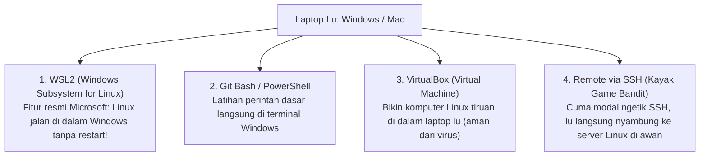
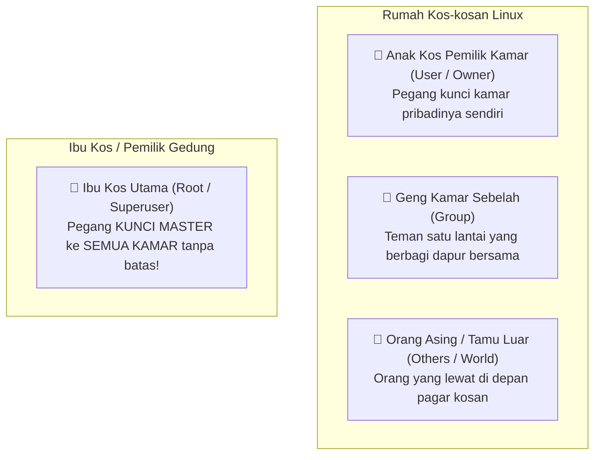

# Modul Pertemuan 2: Hak Akses File, Rahasia Superuser, & Administrasi Sistem

> **Mata Kuliah / Kegiatan:** Pembekalan Dasar Anggota UKM Cyber Security (Cysec)  
> **Durasi:** 3 Jam (180 Menit)  
> **Tingkat Kesulitan:** Pemula (Step-up dari Pertemuan 1)  
> **Prasyarat:** Sudah paham navigasi dasar terminal (`pwd`, `ls`, `cd`, `cat`, tombol TAB).

---

## 🎙️ Kata Pembuka dari Mentor
> *"Halo temen-temen anggota UKM Cysec! Luar biasa banget antusiasme di pertemuan kemarin.*  
> *Di Pertemuan 1, lu semua sudah berhasil membunuh rasa takut pada layar hitam terminal, bahkan sudah sukses tembus wargame bandit sampai level 5.*  
>  
> *Nah, hari ini kita bakal masuk ke salah satu konsep paling sakral di dunia keamanan siber: **'Siapa yang Boleh Masuk Kamar Siapa?'** alias **Hak Akses (Permissions)**.*  
> *Di dunia nyata, maling sering kali berhasil bukan karena menjebol tembok beton, melainkan karena pemilik rumah salah menaruh kunci atau lupa mengunci pintu belakang. Hari ini kita bakal bongkar rahasia di balik tulisan aneh `rwxr-xr--`, membongkar bahaya akun dewa `root`, dan menaklukkan Bandit Level 6 sampai 10. Tarik napas, siapin kopi atau teh lu, dan yuk kita mulai!"*

---

# 📑 DAFTAR ISI
1. [FAQ Pemula: "Bang, Belajar Cyber Security Apakah Laptop Wajib Linux?"](#faq-pemula-bang-belajar-cyber-security-apakah-laptop-wajib-linux)
2. [Jam 1: Konsep Hak Akses dari Kacamata Hacker (Analogi Kos-kosan)](#jam-1-konsep-hak-akses-dari-kacamata-hacker-analogi-kos-kosan)
3. [Jam 1.5: Membedah Hieroglif `rwx` & Rahasia Angka 777](#jam-15-membedah-hieroglif-rwx--rahasia-angka-777)
4. [Jam 2: Kamus Praktik Administrasi & Pemantauan Sistem (Hands-on)](#jam-2-kamus-praktik-administrasi--pemantauan-sistem-hands-on)
5. [Jam 3: Misi Tempur Lanjutan: Game OverTheWire Bandit (Level 5 - Level 10)](#jam-3-misi-tempur-lanjutan-game-overthewire-bandit-level-5---level-10)
6. [Refleksi, Bahaya Fatal, & Tugas Mandiri](#refleksi-bahaya-fatal--tugas-mandiri)

---

# ❓ FAQ Pemula: "Bang, Belajar Cyber Security Apakah Laptop Wajib Linux?"

Sebelum kita masuk lebih dalam ke hak akses sistem, ini adalah pertanyaan paling klasik yang sering bikin anggota baru minder atau *overthinking*:  
> *"Bang, laptop gua Windows biasa (atau MacBook). Apakah gua harus install ulang ganti Linux? Apa gua harus beli laptop baru khusus hacker?"*

### Jawabannya: NGGAK HARUS! Jangan buru-buru format laptop lu!
Laptop lu tetap pakai Windows atau Mac seperti biasa. Jangan sekali-kali nekat memformat harddisk atau *dual-boot* kalau masih pemula, nanti tugas kuliah atau data penting lu malah hilang gara-gara salah partisi!

---

### 🚗 Analogi: Mobil Matic Keluarga vs Mobil Balap Bengkel
Biar lu paham kenapa dunia siber lekat banget sama Linux:
* **Windows itu ibarat Mobil Matic Keluarga:**  
  Sangat nyaman dipakai sehari-hari, tombolnya serba otomatis, tampilannya rapi. Tapi pabriknya sengaja **mengunci kap mesin** biar pengguna biasa nggak sembarangan mencabut kabel dan merusak sistem.
* **Linux itu ibarat Mobil Balap / Mesin di Bengkel Terbuka:**  
  Semua baut, kabel, dan mesinnya telanjang kelihatan jelas. Lu bebas memodifikasi, mengutak-atik, dan mengatur sistemnya sampai ke baut terkecil tanpa ada yang disembunyikan.

> 🌐 **Fakta Industri Nyata:**  
> Lebih dari **90% server internet di seluruh dunia** (server Google, server bank, infrastruktur cloud AWS/Azure, sampai sistem operasi HP Android) **berjalan di atas Linux!**  
> Praktisi siber belajar Linux bukan karena sok keren atau mau gaya-gayaan, tapi karena rumah dan brankas yang mau kita amankan (atau kita uji) memang mayoritas memakai Linux.

---

### 💡 4 Cara Santai Menikmati Linux Tanpa Perlu Hapus Windows:


1. **WSL2 (Windows Subsystem for Linux) — *Pilihan Terbaik!*:**  
   Fitur resmi buatan Microsoft. Terminal Ubuntu asli bisa dibuka langsung di dalam Windows tanpa perlu restart komputer dan tanpa bikin laptop berat.
2. **Koneksi Jarak Jauh (SSH) — *Kayak di Game Bandit Hari Ini!*:**  
   Laptop lu 100% Windows, lu cuma buka terminal biasa, lalu ketik `ssh`. Komputer yang bekerja keras memproses Linux adalah server di awan internet!
3. **VirtualBox / VMware (Mesin Virtual):**  
   Bikin "komputer di dalam komputer". Kalau lu lagi latihan uji malware di Linux virtual dan sistemnya rusak, laptop Windows utama lu tetap 100% aman (tinggal hapus mesin virtualnya).
4. **Plot Twist Industri (Keahlian Windows Justru Sangat Mahal!):**  
   Di dunia kerja nyata, menguasai Windows justru sangat dicari perusahaan! Kenapa? Karena ribuan komputer karyawan kantor, Active Directory kantor, dan sasaran empuk *Ransomware* semuanya berbasis Windows. Jadi di UKM Cysec, kita pelajari kedua dunia ini secara seimbang!

---

# 🏠 JAM 1: Konsep Hak Akses dari Kacamata Hacker (Analogi Kos-kosan)

Bayangkan sistem operasi komputer (terutama Linux) itu seperti **Sebuah Rumah Kos-kosan Bertingkat Raksasa**.

Di dalam kos-kosan ini ada puluhan anak kos yang tinggal bersama. Agar kos-kosan ini tidak ricuh dan barang-barang pribadi tidak hilang, pengelola kos membagi orang-orang menjadi **3 Golongan**:



### 1. Tiga Golongan Pengguna (The 3 Realms):
1. **User (`u` / Owner):** Pemilik file atau folder tersebut (misal: anak kamar 101).
2. **Group (`g`):** Sekumpulan pengguna yang disatukan dalam satu kelompok (misal: geng mahasiswa UKM Cysec yang berbagi folder proyek bersama).
3. **Others (`o` / World):** Siapa pun pengguna lain yang ada di komputer tersebut atau orang luar yang berhasil menyusup.

---

### 2. Tiga Jenis Kekuatan Izin Akses (`rwx`):
Pada setiap pintu kamar atau lemari, ada 3 jenis stempel izin yang bisa diberikan:

| Simbol | Kepanjangan | Analogi di Kamar Kos | Fungsi Nyata pada File |
| :---: | :---: | :--- | :--- |
| **`r`** | **Read** (Baca) | Boleh mengintip lewat jendela kamar / membaca surat. | Membuka dan membaca isi teks file. |
| **`w`** | **Write** (Tulis) | Boleh mengacak-acak, mencorat-coret, atau membakar isi kamar. | Mengubah, mengedit, atau menghapus file. |
| **`x`** | **Execute** (Jalankan) | Boleh menyalakan saklar lampu atau menyalakan mesin motor di garasi. | Menjalankan file sebagai program/skrip aplikasi. |

---

# 🔍 JAM 1.5: Membedah Hieroglif `rwx` & Rahasia Angka 777

Pernahkah lu ngetik `ls -la` di Linux terus melihat tulisan aneh seperti ini di sebelah kiri?
```text
-rwxr-xr--  1 wildan cysec  4096 Sep 10 14:00 skrip_rahasia.sh
drwxr-xr-x  2 wildan cysec  4096 Sep 10 14:02 folder_dokumen
```

Bagi orang awam, itu kelihatan seperti mantra kuno yang membingungkan. Padahal itu sangat gampang dibaca kalau kita pecah menjadi **4 Bagian (Total 10 Karakter)**:

```text
  -   |   r w x   |   r - x   |   r - -
 [1]  |    [2]    |    [3]    |    [4]
 Tipe |   Owner   |   Group   |  Others
```

1. **Karakter ke-1 (Tipe Barang):**
   * `-` = File biasa (dokumen teks, foto, video).
   * `d` = Direktori (*Directory* / Folder).
2. **Karakter ke-2 s.d 4 (Hak Pemilik / User):**
   * `rwx` artinya si pemilik file boleh **Membaca (`r`)**, **Mengedit (`w`)**, dan **Menjalankan (`x`)**.
3. **Karakter ke-5 s.d 7 (Hak Teman Segrup / Group):**
   * `r-x` artinya anggota grup boleh **Membaca (`r`)** dan **Menjalankan (`x`)**, tapi tanda strip `-` artinya mereka **DILARANG Mengedit/Menghapus**.
4. **Karakter ke-8 s.d 10 (Hak Orang Asing / Others):**
   * `r--` artinya orang asing cuma boleh **Membaca (`r`)** saja, tidak boleh mengedit dan tidak boleh menjalankan.

---

### 🧮 Rahasia Angka Tiga Digit (Kenapa Ada Angka `777`, `755`, `644`?)

Hacker dan Sysadmin sering menggunakan angka saat mengatur hak akses. Dari mana angka itu berasal?
Ternyata ini adalah matematika biner sederhana:
* **Read (`r`) = bernilai 4**
* **Write (`w`) = bernilai 2**
* **Execute (`x`) = bernilai 1**
* **Tidak Ada Izin (`-`) = bernilai 0**

Tinggal jumlahkan angkanya untuk tiap golongan:
* Kalau mau `rwx` (Baca + Tulis + Eksekusi) = **4 + 2 + 1 = 7**
* Kalau mau `r-x` (Baca + Eksekusi) = **4 + 0 + 1 = 5**
* Kalau mau `rw-` (Baca + Tulis) = **4 + 2 + 0 = 6**
* Kalau mau `r--` (Baca saja) = **4 + 0 + 0 = 4**

```
Contoh Kode Angka:
• 755 ➔ Owner: 7 (rwx) | Group: 5 (r-x) | Others: 5 (r-x)  ➔ Standar skrip aplikasi
• 644 ➔ Owner: 6 (rw-) | Group: 4 (r--) | Others: 4 (r--)  ➔ Standar file dokumen/web
• 600 ➔ Owner: 6 (rw-) | Group: 0 (---) | Others: 0 (---)  ➔ Standar file kunci rahasia (SSH Key)
```

> 🚨 **PERINGATAN KERAS MENTOR (Dosa Besar `chmod 777`):**  
> Banyak tutorial ngawur di internet yang bilang: *"Kalau file lu error atau gak bisa dibuka, ketik aja `chmod 777`"*.  
> **JANGAN PERNAH LAKUKAN INI DI SISTEM PRODUKSI!**  
> Memberi izin `777` sama saja seperti lu membuka pintu kamar kos lu selebar-lebarnya, melepas gagang pintu, dan menaruh plang: *"Silakan siapa pun boleh masuk, acak-acak kasur gua, atau bakar kamar ini."* Hacker paling suka nemu file berizin `777`!

---

### 👑 Akun Dewa: Root & Perintah `sudo`
* **Root:** Pengguna tertinggi di sistem Linux (nomor ID: 0). Root bisa menghapus seluruh file sistem, mematikan sistem keamanan, dan membaca email semua user tanpa izin.
* **`sudo` (SuperUser DO):** Perintah sakti untuk meminjam kekuatan Ibu Kos selama beberapa detik untuk melakukan tugas penting (misal: install aplikasi).
* **Prinsip Keamanan Siber (*Principle of Least Privilege*):**  
  Jangan pernah hidup sehari-hari menggunakan akun root! Gunakan akun biasa, dan hanya panggil `sudo` saat benar-benar dibutuhkan. Kalau lu main game atau browsing pakai akun root dan kena virus, virus itu otomatis langsung punya hak setingkat dewa untuk menghancurkan seluruh laptop lu!

---

# ⚡ JAM 2: Kamus Praktik Administrasi & Pemantauan Sistem (Hands-on)

Sekarang buka terminal lu, kita praktikkan langsung perintah untuk mengatur hak akses dan memata-matai proses yang berjalan di komputer!

---

### 🔑 Mantra 1: `chmod` — Mengubah Izin Pintu Kamar
* **Kepanjangan:** *Change Mode*
* **Cara 1: Menggunakan Simbol (Paling Manusiawi):**
  * Tambahkan izin eksekusi ke skrip:
    ```bash
    chmod +x skrip_saya.sh
    ```
  * Cabut izin membaca dari orang asing (others):
    ```bash
    chmod o-r dokumen_rahasia.txt
    ```
* **Cara 2: Menggunakan Angka (Cepat & Presisi):**
  * Kunci file agar cuma lu sendiri yang bisa baca & edit:
    ```bash
    chmod 600 kunci_rahasia.pem
    ```

---

### 👤 Mantra 2: `chown` — Mengganti Pemilik Rumah
* **Kepanjangan:** *Change Owner*
* **Fungsi:** Mengalihkan kepemilikan file ke user atau grup lain (biasanya butuh `sudo`):
  ```bash
  sudo chown wildan:cysec laporan_keuangan.txt
  ```
  *(Artinya: File ini sekarang dimiliki oleh user `wildan` dan grup `cysec`).*

---

### 🕵️ Mantra 3: `ps aux` — Senter Pengintai Tamu Gelap
* **Fungsi:** Menampilkan **seluruh proses dan aplikasi** yang sedang berjalan di komputer detik ini.
* **Cara pakai:**
  ```bash
  ps aux
  ```
* Layar bakal menampilkan ribuan baris proses! Biar nggak pusing, gabungkan dengan detektif `grep`:
  ```bash
  ps aux | grep "python"
  ```
  *(Mencari tahu apakah ada skrip python mencurigakan yang sedang berjalan diam-diam).*

---

### 💓 Mantra 4: `top` / `htop` — Monitor Detak Jantung Sistem
* **Fungsi:** Seperti Task Manager di Windows, tapi versi terminal yang sangat responsif. Menampilkan aplikasi mana yang lagi rakus makan RAM dan CPU.
* **Cara pakai:**
  ```bash
  top
  ```
  *(Tekan tombol huruf **`q`** di keyboard untuk keluar).*

---

### 🛑 Mantra 5: `kill` — Satpam Pengusir Tamu Nakal
* **Fungsi:** Mematikan paksa aplikasi atau virus yang macet/mencurigakan menggunakan nomor **PID (Process ID)** yang didapat dari `ps aux`.
* **Cara sopan:**
  ```bash
  kill 1234
  ```
  *(Mengetuk pintu dan meminta proses 1234 untuk menutup diri).*
* **Cara satpam brutal (Paling Sering Dipakai Praktisi):**
  ```bash
  kill -9 1234
  ```
  *(`-9` artinya SIGKILL: Jangan banyak tanya, bunuh proses ini seketika detik ini juga!).*

---

### 📌 Tabel Rangkuman Perintah Pertemuan 2:
| Perintah | Analogi Sehari-hari | Fungsi Nyata |
| :--- | :--- | :--- |
| `ls -la` | Cek gembok pintu kamar | Melihat rincian hak akses `rwx` seluruh file |
| `chmod +x file` | Kasih kunci kontak motor | Mengizinkan file untuk dijalankan sebagai program |
| `chmod 600 file` | Gembok brankas pribadi | Mengunci file agar hanya pemilik yang bisa akses |
| `chown user:grup file`| Akta jual beli rumah | Mengganti pemilik dan grup file |
| `ps aux` | Absensi tamu di ruang tunggu | Melihat semua program yang sedang aktif berjalan |
| `top` | Monitor CCTV ruang rawat | Memantau penggunaan CPU & RAM secara live |
| `kill -9 <PID>` | Menyeret penyusup keluar | Mematikan paksa proses sistem yang bandel |

---

# 🏴‍☠️ JAM 3: Misi Tempur Lanjutan: Game OverTheWire Bandit (Level 5 - Level 10)

Waktunya membuktikan pemahaman hak akses dan manipulasi file di server latihan dunia nyata!

Siapkan terminal lu dan catatan password dari Pertemuan 1 kemarin.

---

### 🎯 Level 5 ➔ Level 6: "Mencari Jarum di Tumpukan Jerami"
* **Misi:** Login sebagai `bandit5`. Password ada di suatu tempat di folder `inhere` yang penuh dengan sub-folder bertingkat (`maybehere00` s.d. `maybehere19`).
* **Kriteria File Target:**
  1. Bersifat teks yang bisa dibaca manusia (*human-readable*).
  2. Ukurannya **tepat 1033 bytes**.
  3. **TIDAK BISA DIEKSEKUSI** (tidak punya izin execute `! -executable`).
* **Logika Hacker:**
  Jangan buka puluhan folder satu-satu secara manual! Gunakan mantra pelacak `find` yang dilengkapi filter kriteria:
* **Langkah Eksekusi:**
  ```bash
  cd inhere
  find . -type f -size 1033c ! -executable
  ```
  * Penjelasan:
    * `.` = Cari mulai dari folder saat ini.
    * `-type f` = Hanya cari yang berjenis file biasa (bukan folder).
    * `-size 1033c` = Ukurannya tepat 1033 bytes (`c` = character/bytes).
    * `! -executable` = Tanda seru artinya BUKAN / TIDAK memiliki izin eksekusi.
* **Hasil:** Muncul satu jalur file: `./maybehere07/.file2`. Baca dengan `cat`:
  ```bash
  cat ./maybehere07/.file2
  ```
* **Simpan password bandit6 ke Notepad lu!**

---

### 🎯 Level 6 ➔ Level 7: "Mencari Berkas Rahasia di Seluruh Penjuru Server"
* **Misi:** Login sebagai `bandit6`. File password tidak ada di folder home lu, melainkan tersembunyi di suatu tempat **di seluruh penjuru server komputer** dengan kriteria:
  1. Pemilik file adalah user **`bandit7`**
  2. Grup file adalah **`bandit6`**
  3. Ukuran filenya tepat **33 bytes**
* **Logika Hacker:**
  Karena lokasinya bisa di mana saja di komputer, kita harus mencari mulai dari akar sistem paling atas, yaitu tanda garis miring (`/`).
  Tapi ingat: Sebagai user biasa, ada ribuan folder milik sistem yang dilarang kita buka, sehingga layar bakal banjir pesan error *Permission Denied*.
* **Trik Hacker Menghilangkan Pesan Sampah (`2>/dev/null`):**
  Di Linux, pesan error dialirkan lewat saluran nomor `2`. Kita bisa membuang saluran error ini ke lubang hitam digital bernama `/dev/null`:
* **Langkah Eksekusi:**
  ```bash
  find / -user bandit7 -group bandit6 -size 33c 2>/dev/null
  ```
* **Hasil:** Keluar 1 file bersih tanpa sampah error: `/var/lib/dpkg/info/bandit7.password`.
* Baca isinya:
  ```bash
  cat /var/lib/dpkg/info/bandit7.password
  ```
* Salin password bandit7, lalu ketik `exit`.

---

### 🎯 Level 7 ➔ Level 8: "Menggeledah Kamus Berisi Sejuta Kata"
* **Misi:** Login sebagai `bandit7`. Password disimpan di dalam file bernama `data.txt`, persis di sebelah kata **`millionth`**.
* **Masalah:** File `data.txt` ukurannya sangat raksasa dan berisi puluhan ribu baris. Membaca baris demi baris pakai `cat` bakal bikin mata lu rabun!
* **Solusi Detektif `grep`:**
  Kirim detektif `grep` untuk menyaring baris yang cuma mengandung kata kunci tersebut:
* **Langkah Eksekusi:**
  ```bash
  grep "millionth" data.txt
  ```
* **Hasil:** Password bandit8 langsung muncul di sebelah kata millionth! Salin ke Notepad.

---

### 🎯 Level 8 ➔ Level 9: "Mencari yang Berbeda Sendiri (Baris Unik Tanpa Kembaran)"
* **Misi:** Login sebagai `bandit8`. Password ada di file `data.txt`. Di dalam file ini, hampir semua baris teks diulang-ulang berkali-kali, **hanya ada SATU baris yang muncul tepat 1 kali saja**.
* **Logika Hacker & Konsep Pipa (`|`):**
  Linux punya mantra bernama `uniq -u` (ambil yang unik). Tapi syarat `uniq` bekerja adalah **data harus diurutkan terlebih dahulu** agar baris yang kembar saling menempel.
  Kita gabungkan mantra pengurut `sort` dan mantra penyaring `uniq` menggunakan pipa (`|`):
* **Langkah Eksekusi:**
  ```bash
  sort data.txt | uniq -u
  ```
  *(Analogi pipa `|`: Hasil cucian dari mesin cuci `sort` langsung dialirkan lewat pipa ke mesin pengering `uniq` tanpa harus disimpan ke ember baru).*
* **Hasil:** Password bandit9 keluar dengan anggun!

---

### 🎯 Level 9 ➔ Level 10: "Menyelamatkan Surat dari File Rusak/Biner"
* **Misi:** Login sebagai `bandit9`. File `data.txt` adalah file data biner acak (kalau di-`cat`, terminal lu bakal bunyi 'beep' dan layarnya penuh simbol alien). Tapi di dalamnya terselip sebaris teks manusia yang diawali banyak tanda sama dengan (`===`).
* **Mantra Sakti `strings`:**
  Mantra `strings` berfungsi mengekstrak karakter huruf manusia yang terselip di dalam file biner/kompilasi:
* **Langkah Eksekusi:**
  ```bash
  strings data.txt | grep "==="
  ```
* **Hasil:** Deretan tanda `========== the password is [KODE_PASSWORD]` terpampang jelas! Salin password bandit10.

---

### 🎯 Level 10 ➔ Level 11: "Membongkar Paket Berbalut Sandi Base64"
* **Misi:** Login sebagai `bandit10`. Password ada di dalam file `data.txt` yang berisi data yang disandikan dengan format **Base64**.
* **Konsep Siber:**
  Base64 itu **BUKAN enkripsi rahasia**, melainkan cuma cara komputer membungkus data biner jadi karakter teks agar aman dikirim lewat jaringan (seperti membungkus barang pecah belah pakai kardus dan lakban).
* **Langkah Eksekusi:**
  Buka bungkus kardus Base64 dengan parameter `-d` (*decode*):
  ```bash
  base64 -d data.txt
  ```
* **Hasil:** Password bandit11 berhasil kita rampas!

---

# 🧠 REFLEKSI, BAHAYA FATAL, & TUGAS MANDIRI

Luar biasa! Dalam pertemuan kedua ini, skill siber lu sudah melonjak jauh:
1. Lu sudah bisa membaca izin file layaknya seorang sysadmin profesional (`rwxr-xr--`).
2. Paham kenapa `chmod 777` adalah malapetaka keamanan.
3. Mengerti bahaya akun dewa `root` dan filosofi *Least Privilege*.
4. Berhasil menembus **Bandit Level 5 sampai Level 10** menggunakan kombinasi perintah sakti: `find`, `grep`, pipa `|`, `sort`, `uniq`, `strings`, dan `base64`.

---

### ⚠️ 3 Dosa Fatal yang Sering Dilakukan Pemula:
1. **Lupa memberi titik garis miring (`./`) saat menjalankan skrip:**  
   Kalau lu punya skrip `backup.sh` dan lu ketik `backup.sh`, Linux bakal bilang *command not found*. Ketik: `./backup.sh`!
2. **Menjalankan perintah berbahaya dengan `sudo` tanpa membaca dulu isinya:**  
   Jangan pernah *copy-paste* perintah dari internet yang diawali `sudo` kalau lu nggak paham apa arti perintah tersebut.
3. **Mengabaikan pesan error:**  
   Pesan error seperti `Permission denied` atau `No such file or directory` adalah petunjuk paling jujur dari komputer tentang apa yang kurang.

---

### 📝 Tugas Santai Sebelum Pertemuan 3:
1. Pastikan password Bandit dari level 0 sampai 11 tersimpan rapi di file catatan terenkripsi atau Notepad laptop lu.
2. Coba eksplorasi sendiri wargame **Bandit Level 11 ke Level 12**:  
   *(Petunjuk: Level 11 menggunakan sandi geser huruf kuno bernama **ROT13**. Coba cari tahu cara memecahkannya menggunakan mantra `tr` atau web [CyberChef](https://gchq.github.io/CyberChef/)).*
3. Di Pertemuan 3 nanti, kita akan belajar **bikin robot automasi skrip Bash pertama kita** dan membedah **kenapa software bajakan/crack game adalah sarang malware!**

---

### 📺 Video Referensi Rekomendasi (Pertemuan 2):
* 🇮🇩 **Dea Afrizal:** [Linux Permission & User Management untuk Pemula](https://www.youtube.com/results?search_query=dea+afrizal+linux+permission) *(Penjelasan santai hak akses chmod & chown).*
* 🇬🇧 **NetworkChuck:** [Linux Permissions are EASY (chmod, chown, 777)](https://www.youtube.com/watch?v=5cb_c_6i4uY) *(Animasi visual terbaik tentang logika matematika biner hak akses Linux).*
* 🇬🇧 **John Hammond:** [OverTheWire Bandit Walkthrough Level 6 to 12](https://www.youtube.com/results?search_query=john+hammond+overthewire+bandit+level+6) *(Tonton kalau lu penasaran cara berpikir hacker saat menghadapi kebuntuan).*

