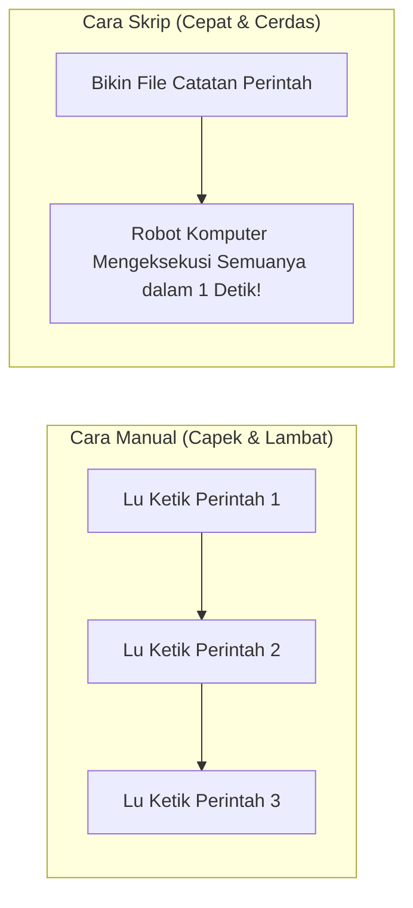
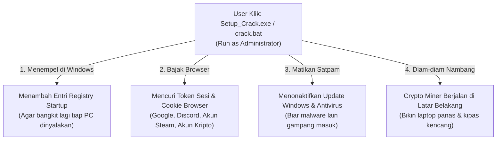

# 📑 DAFTAR ISI
1. [Jam 1: Konsep Automasi dari Kacamata Hacker (Analogi Robot Asisten)](#jam-1-konsep-automasi-dari-kacamata-hacker-analogi-robot-asisten)
2. [Jam 1.5: Linux Bash vs Windows Batch (Perbandingan Dua Dunia)](#jam-15-linux-bash-vs-windows-batch-perbandingan-dua-dunia)
3. [Jam 2: Hands-on Workshop: Meracik 3 Skrip Pembantu (Versi Linux & Windows)](#jam-2-hands-on-workshop-meracik-3-skrip-pembantu-versi-linux--windows)
   * [Lab 1: Skrip Pengecek Status Jaringan (Linux `.sh` & Windows `.bat`)](#-lab-1-skrip-pengecek-status-jaringan)
   * [Lab 2: Skrip Backup Otomatis Berstempel Waktu (Linux `.sh` & Windows `.bat`)](#-lab-2-skrip-backup-otomatis-berstempel-waktu)
   * [Lab 3: Skrip Audit Keamanan & Hak Akses (Linux `.sh` & Windows `.bat`)](#-lab-3-skrip-audit-keamanan--hak-akses)
4. [Jam 3: Studi Kasus Nyata: Mengapa Software Bajakan & Cheat Game Itu Jebakan Batman?](#jam-3-studi-kasus-nyata-mengapa-software-bajakan--cheat-game-itu-jebakan-batman)
5. [Refleksi Akhir Bulan 1 & Persiapan Menuju Dunia Jaringan (Bulan 2)](#refleksi-akhir-bulan-1--persiapan-menuju-dunia-jaringan-bulan-2)

---

# 🤖 JAM 1: Konsep Automasi dari Kacamata Hacker (Analogi Robot Asisten)

Bayangkan lu punya asisten pribadi di rumah. 

Setiap pagi lu bangun tidur, lu harus memberi tahu dia:
1. *"Tolong buka pintu gerbang."*
2. *"Tolong siram tanaman depan."*
3. *"Tolong beliin kopi di warung sebelah."*
4. *"Tolong kunci lagi pintu gerbangnya."*

Kalau setiap hari lu harus ngomong kalimat yang sama persis berulang-ulang, pasti capek kan?



Solusi cerdasnya: **Lu tulis semua perintah itu di selembar kertas catatan.** Besok paginya, lu cukup serahkan kertas itu ke asisten lu dan bilang: *"Jalankan semua yang ada di kertas ini!"*

* Di dunia Linux, kertas catatan itu berekstensi **`.sh` (Bash Script)**.
* Di dunia Windows, kertas catatan itu berekstensi **`.bat` (Batch Script)**.

---

### Kenapa Hacker & Pakar Keamanan Siber WAJIB Bisa Bikin Skrip?
1. **Hacker Menyerang Ribuan Target dalam Hitungan Detik:**  
   Penyerang tidak pernah menguji kelemahan 1.000 server satu per satu dengan tangan. Mereka menulis skrip otomatis untuk mengetuk pintu 1.000 server sekaligus saat mereka sedang tidur nyenyak.
2. **Defender (Tim Bertahan) Merespons Secara Otomatis:**  
   Kalau ada penyerang mencoba menebak password admin 50 kali dalam 10 detik (*brute-force*), skrip pertahanan akan otomatis memblokir alamat IP penyerang tanpa menunggu satpam manusia bangun dari tidur.
3. **Mencegah Kelalaian Manusia (*Human Error*):**  
   Manusia bisa lupa mencadangkan data atau salah ketik perintah. Skrip komputer tidak pernah lupa dan selalu patuh pada instruksi.

---

# ⚖️ JAM 1.5: Linux Bash vs Windows Batch (Perbandingan Dua Dunia)

Biar lu nggak bingung kalau coding di Linux atau di Windows Command Prompt (CMD), ini tabel perbedaan sintaks dasarnya:

| Fitur / Logika | Linux Bash (`.sh`) | Windows Batch (`.bat`) | Analogi Sehari-hari |
| :--- | :--- | :--- | :--- |
| **Mantra Pembuka** | `#!/bin/bash` | `@echo off` | Memberitahu komputer jenis bahasa yang dipakai |
| **Menampilkan Teks** | `echo "Halo Dunia"` | `echo Halo Dunia` | Berbicara / menyapa pengguna di layar |
| **Menyimpan Kotak (Variabel)** | `NAMA="Wildan"` | `set NAMA=Wildan` | Memasukkan barang ke dalam kotak berlabel |
| **Memanggil Variabel** | `$NAMA` | `%NAMA%` | Mengambil barang dari kotak |
| **Menerima Input Pengguna** | `read USERNAME` | `set /p USERNAME="Masukkan nama: "` | Menunggu pengguna mengetik jawaban |
| **Mengecek Sukses / Gagal** | `$?` (0 = sukses) | `%errorlevel%` (0 = sukses) | Menanyakan laporan apakah perintah berhasil |
| **Menahan Jendela Layar** | *(Otomatis tetap buka)* | `pause` | Mencegah jendela CMD langsung tutup sekejap mata |

---

# ⚡ JAM 2: Hands-on Workshop: Meracik 3 Skrip Pembantu (Versi Linux & Windows)

Pilih lingkungan yang lu pakai hari ini:
* Kalau pakai **Git Bash / WSL / Linux**, buat file berekstensi `.sh`.
* Kalau pakai **Windows Command Prompt (CMD)** biasa, buka Notepad dan simpan sebagai file berekstensi `.bat` (pilih *Save as type: All Files*).

---

### 🛠️ Lab 1: Skrip Pengecek Status Jaringan

Skrip ini bertugas seperti satpam yang mengetuk pintu server target untuk melihat apakah server tersebut sedang hidup (online) atau mati (offline).

#### 🐧 Versi Linux Bash (`cek_target.sh`):
```bash
#!/bin/bash

echo "=== CYSEC NETWORK SCANNER (LINUX BASH) ==="
echo -n "Masukkan alamat website/IP target: "
read TARGET

echo "[*] Sedang mengetuk pintu target $TARGET..."
ping -c 1 $TARGET > /dev/null 2>&1

if [ $? -eq 0 ]; then
    echo "[+] BINGO! Target $TARGET sedang ONLINE dan merespons!"
else
    echo "[-] WADUH! Target $TARGET sedang OFFLINE atau memblokir ping!"
fi
```
*Cara jalankan di terminal:* `chmod +x cek_target.sh` lalu `./cek_target.sh`

#### 🪟 Versi Windows Batch (`cek_target.bat`):
```batch
@echo off
title Cysec Network Scanner (Windows Batch)
echo =========================================
echo   CYSEC NETWORK SCANNER (WINDOWS BATCH)
echo =========================================
set /p TARGET="Masukkan alamat website/IP target: "

echo [*] Sedang mengetuk pintu target %TARGET%...
ping -n 1 %TARGET% >nul 2>&1

if %errorlevel% equ 0 (
    echo [+] BINGO! Target %TARGET% sedang ONLINE dan merespons!
) else (
    echo [-] WADUH! Target %TARGET% sedang OFFLINE atau memblokir ping!
)

echo.
pause
```
*Cara jalankan di Windows:* Cukup **klik dua kali (double-click)** pada file `cek_target.bat` atau jalankan dari CMD!

---

### 🛠️ Lab 2: Skrip Backup Otomatis Berstempel Waktu

Sebagai calon praktisi siber, aturan nomor satu adalah: **Sebelum lu otak-atik sistem atau sebelum kena ransomware, CADANGKAN DATA PENTING LU!**

#### 🐧 Versi Linux Bash (`backup_aman.sh`):
```bash
#!/bin/bash

TANGGAL=$(date +%Y-%m-%d_%H-%M-%S)
FOLDER_ASAL="catatan_penting"
FOLDER_BACKUP="arsip_cadangan"

mkdir -p $FOLDER_ASAL
mkdir -p $FOLDER_BACKUP

echo "Mencadangkan folder $FOLDER_ASAL pada tanggal $TANGGAL..."
tar -czf "$FOLDER_BACKUP/backup_$TANGGAL.tar.gz" $FOLDER_ASAL

echo "[+] Pencadangan selesai! File disimpan di $FOLDER_BACKUP/backup_$TANGGAL.tar.gz"
```

#### 🪟 Versi Windows Batch (`backup_aman.bat`):
*(Di Windows 10 dan 11 modern, perintah kompresi `tar` sudah tersedia resmi bawaan dari Microsoft!)*
```batch
@echo off
title Backup Otomatis Cysec (Windows Batch)
echo =========================================
echo        PENCADANGAN DATA OTOMATIS
echo =========================================

set FOLDER_ASAL=catatan_penting
set FOLDER_BACKUP=arsip_cadangan

if not exist %FOLDER_ASAL% mkdir %FOLDER_ASAL%
if not exist %FOLDER_BACKUP% mkdir %FOLDER_BACKUP%

:: Mengambil format tanggal dan jam lokal Windows
set TANGGAL=%date:~10,4%-%date:~4,2%-%date:~7,2%_%time:~0,2%-%time:~3,2%
set TANGGAL=%TANGGAL: =0%

echo [*] Mencadangkan folder %FOLDER_ASAL% ke arsip...
tar -czf "%FOLDER_BACKUP%\backup_%TANGGAL%.tar.gz" %FOLDER_ASAL%

echo [+] Pencadangan selesai! File disimpan di %FOLDER_BACKUP%\backup_%TANGGAL%.tar.gz
echo.
pause
```

---

### 🛠️ Lab 3: Skrip Audit Keamanan & Hak Akses

#### 🐧 Versi Linux Bash (`audit_izin.sh`):
Mencari file berizin berbahaya `777` di sistem Linux:
```bash
#!/bin/bash

echo "=== AUDIT KEAMANAN HAK AKSES LINUX ==="
echo "Mencari file berizin berbahaya (777) di folder saat ini..."

BAHAYA=$(find . -type f -perm 0777)

if [ -z "$BAHAYA" ]; then
    echo "[+] AMAN! Tidak ditemukan file dengan izin 777."
else
    echo "[!] PERINGATAN! File berbahaya ditemukan:"
    echo "$BAHAYA"
    echo "Segera kunci file tersebut dengan perintah: chmod 644 <nama_file>"
fi
```

#### 🪟 Versi Windows Batch (`audit_sistem.bat`):
Memeriksa apakah script berjalan dengan hak Administrator (*Level Dewa*) serta memantau port koneksi yang sedang terbuka di Windows:
```batch
@echo off
title Audit Keamanan Sistem Windows
echo =========================================
echo    AUDIT HAK AKSES SISTEM WINDOWS
echo =========================================

echo [*] Memeriksa apakah script berjalan sebagai Administrator...
net session >nul 2>&1
if %errorlevel% equ 0 (
    echo [!] PERINGATAN: Script berjalan dengan Hak ADMINISTRATOR!
    echo     Hati-hati, kesalahan perintah bisa merusak sistem Windows lu.
) else (
    echo [+] AMAN: Script berjalan sebagai User Biasa (Prinsip Least Privilege).
)

echo.
echo [*] Daftar Akun Pengguna Lokal di Komputer ini:
net user

echo.
echo [*] Port Jaringan yang Sedang Mendengarkan (LISTENING):
netstat -ano | findstr "LISTENING"

echo.
pause
```

---

# 🏴‍☠️ JAM 3: Studi Kasus Nyata: Mengapa Software Bajakan & Cheat Game Itu Jebakan Batman?

Sekarang kita masuk ke topik yang paling dekat dengan kehidupan sehari-hari anak muda: **Software Crack, Game Bajakan, dan Cheat Game Online.**

Pernahkah lu mengunduh software Photoshop bajakan, game GTA bajakan, atau aktivator Windows ilegal (seperti KMS Pico abal-abal), lalu di panduannya tertulis:  
> *"PERHATIAN: Matikan Windows Defender dan Antivirus sebelum mengekstrak file ini, karena file crack akan terdeteksi sebagai False Positive!"*

---

### 🐴 Analogi Kuda Troya (The Trojan Horse)

Kisah kuno Yunani: Pasukan Yunani tidak bisa menembus benteng kota Troya yang kokoh. Akhirnya mereka membuat patung **Kuda Kayu Raksasa** sebagai hadiah perdamaian palsu. Rakyat Troya dengan gembira memasukkan kuda itu ke dalam benteng kota mereka. 

Tengah malam, saat seisi kota tidur pulas, perut kuda itu terbuka dan puluhan prajurit elit musuh keluar untuk membantai isi kota dan membuka gerbang benteng selebar-lebarnya!

```
Software Bajakan / Crack Game = Kuda Kayu Raksasa Hadiah Gratis
Komputer Lu = Kota Troya yang Bentengnya Dibuka Sendiri oleh Pemiliknya
```

---

### 🔬 Apa yang Sebenarnya Terjadi Saat Lu Klik "Run as Administrator" pada File Crack?

Bagi orang awam, tampilan luarnya terlihat seperti proses aktivasi biasa: ada musik jedag-jedug, ada progress bar 100%, dan software-nya memang benar-benar bisa terbuka gratis.

**Tapi di balik layar (secara siluman), skrip di dalam file crack itu melakukan 4 Hal Jahat:**



1. **InfoStealer (Pencuri Sesi Login):**  
   Malware zaman sekarang (seperti RedLine, Vidar, Lumma Stealer) tidak mengincar foto selfie lu. Mereka mengincar file database browser Chrome/Edge lu tempat **Cookie Sesi dan Password Tersimpan**.  
   *Hasilnya:* Besok paginya, akun Instagram, Discord, Steam, atau email kampus lu tiba-tiba kirim link penipuan sendiri tanpa lu sadari, padahal lu sudah pasang password rumit!
2. **Crypto Miner (Pencuri Listrik & Hardware):**  
   Prosesor (CPU) dan VGA (GPU) laptop lu diam-diam dipakai menambang mata uang kripto untuk si pembuat crack. Akibatnya: laptop lu jadi panas mendidih, kipas berputar kencang, dan umur laptop jadi pendek.
3. **Botnet / Zombie Network:**  
   Komputer lu dijadikan "tentara bayaran zombie". Suatu hari saat hacker mau menyerang website pemerintah atau kampus dengan serangan DDoS jutaan paket, laptop lu ikut menembakkan serangan tanpa lu ketahui.

---

### 💡 Solusi Hidup Tenang Tanpa Membajak (Keren dan Gratis!)
Sebagai anggota UKM Cyber Security yang beretika, kita tinggalkan kebiasaan membajak. Hampir semua software mahal punya alternatif **Open-Source Gratis** yang aman dan dipakai para profesional:
* Pengganti Microsoft Office ➔ **LibreOffice** atau **Google Docs / Google Sheets**
* Pengganti Adobe Photoshop ➔ **GIMP** atau **Photopea** (berbasis web)
* Pengganti Adobe Premiere ➔ **DaVinci Resolve (Versi Free)** atau **Kdenlive**
* Pengganti Windows Bajakan ➔ **Linux OS (Ubuntu, Mint, Fedora)** yang 100% gratis dan aman

---

# 🧠 REFLEKSI AKHIR BULAN 1 & PERSIAPAN MENUJU BULAN 2

**Selamat! Lu resmi menyelesaikan Bulan Pertama di UKM Cysec!** 🎓

Coba renungkan sejenak apa saja yang sudah lu capai dalam 3 pertemuan ini:
* **Pertemuan 1:** Lu mengenal jeroan komputer (CPU, RAM, Storage) dan membunuh rasa takut pada terminal hitam.
* **Pertemuan 2:** Lu paham sistem kasta hak akses Linux (`rwx`, `chmod`, `chown`), bahaya akun dewa root, dan FAQ apakah wajib pakai Linux.
* **Pertemuan 3:** Lu sudah bisa bikin robot automasi sendiri dengan **Bash Script (`.sh`)** dan **Windows Batch Script (`.bat`)**, serta paham kenapa software crack adalah racun berbalut madu.

---

### 🚀 Sneak Peek Bulan 2: Dunia Jaringan Komputer & Internet!
Di Bulan ke-2 (Pertemuan 4, 5, dan 6), kita akan keluar dari komputer pribadi dan mulai menjelajahi **JALAN RAYA INTERNET**:
* Bagaimana data WhatsApp lu bisa sampai ke HP temen dalam 0,1 detik?
* Membedah alamat IP, Port pintu gerbang, dan buku telepon DNS.
* Praktik langsung menggunakan alat pengintai jaringan legendaris: **Wireshark** (Melihat paket data telanjang di udara!).

---

### 📺 Video Referensi Rekomendasi (Pertemuan 3):
* 🇮🇩 **Dea Afrizal:** [Pengenalan Bash Scripting Dasar untuk Pemula](https://www.youtube.com/results?search_query=dea+afrizal+bash+script) *(Panduan bikin skrip terminal praktis dengan bahasa santai).*
* 🇬🇧 **NetworkChuck:** [Bash Scripting on Linux is EASY](https://www.youtube.com/watch?v=SPwyp2UY-0U) *(Belajar logika variabel, input, dan if-else dengan visual keren).*
* 🇬🇧 **The PC Security Channel:** [How Free Game Cracks Actually Infect You](https://www.youtube.com/results?search_query=pc+security+channel+game+cracks+malware) *(Analisis laboratorium forensik nyata membongkar isi file game bajakan).*
