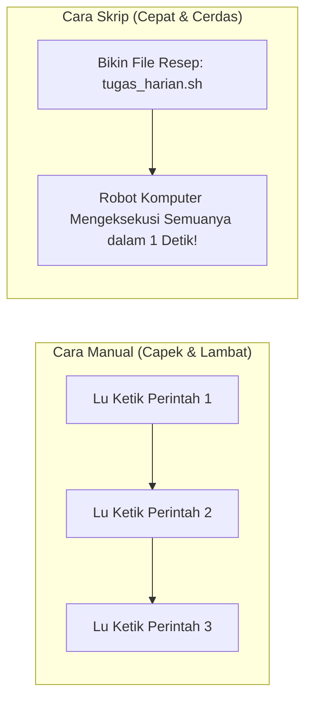
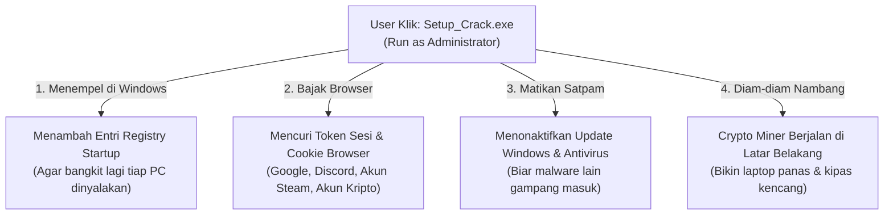

# 📑 DAFTAR ISI
1. [Jam 1: Konsep Automasi dari Kacamata Hacker (Analogi Robot Asisten)](#jam-1-konsep-automasi-dari-kacamata-hacker-analogi-robot-asisten)
2. [Jam 1.5: Anatomi Skrip Bash (Mantra Penulis Robot)](#jam-15-anatomi-skrip-bash-mantra-penulis-robot)
3. [Jam 2: Hands-on Workshop: Meracik 3 Skrip Pembantu Pertama Kita](#jam-2-hands-on-workshop-meracik-3-skrip-pembantu-pertama-kita)
4. [Jam 3: Studi Kasus Nyata: Mengapa Software Bajakan & Cheat Game Itu Jebakan Batman?](#jam-3-studi-kasus-nyata-mengapa-software-bajakan--cheat-game-itu-jebakan-batman)
5. [Refleksi Akhir Bulan 1 & Persiapan Menuju Dunia Jaringan (Bulan 2)](#refleksi-akhir-bulan-1--persiapan-menuju-dunia-jaringan-bulan-2)

---

# 🤖 JAM 1: Konsep Automasi dari Kacamata Hacker (Analogi Robot Asisten)

Bayangkan lu punya asisten pribadi di rumah. 

Setiap pagi lu bangun tidur, lu harus memberi tahu dia:
1. *"Tolong buka pintu gerbang."*
2. *"Tolong siram tanaman depan."*
3. *"Tolong beliin kopi di warung sebelah."*
4. *"Tolong kunci lagi pintu gerbangnya."*

Kalau setiap hari lu harus ngomong kalimat yang sama persis berulang-ulang, pasti capek kan?



Solusi cerdasnya: **Lu tulis semua perintah itu di selembar kertas catatan.** Besok paginya, lu cukup serahkan kertas itu ke asisten lu dan bilang: *"Jalankan semua yang ada di kertas ini!"*

Nah, kertas catatan perintah itu di dunia Linux disebut **Skrip Shell / Bash Script (`.sh`)**.

---

### Kenapa Hacker & Pakar Keamanan Siber WAJIB Bisa Bikin Skrip?
1. **Hacker Menyerang Ribuan Target dalam Hitungan Detik:**  
   Penyerang tidak pernah menguji kelemahan 1.000 server satu per satu dengan tangan. Mereka menulis skrip otomatis untuk mengetuk pintu 1.000 server sekaligus saat mereka sedang tidur nyenyak.
2. **Defender (Tim Bertahan) Merespons Secara Otomatis:**  
   Kalau ada penyerang mencoba menebak password admin 50 kali dalam 10 detik (*brute-force*), skrip pertahanan akan otomatis memblokir alamat IP penyerang tanpa menunggu satpam manusia bangun dari tidur.
3. **Mencegah Kelalaian Manusia (*Human Error*):**  
   Manusia bisa lupa mencadangkan data atau salah ketik perintah. Skrip komputer tidak pernah lupa dan selalu patuh pada instruksi.

---

# 📝 JAM 1.5: Anatomi Skrip Bash (Mantra Penulis Robot)

Sebuah file skrip Bash biasanya berekstensi `.sh` (contoh: `robot_saya.sh`). Di dalamnya ada beberapa komponen utama:

### 1. Mantra Shebang (`#!/bin/bash`)
Baris paling pertama di setiap file skrip **WAJIB** diawali dengan mantra ini:
```bash
#!/bin/bash
```
* **Artinya:** *"Woi komputer! Tolong terjemahkan dan jalankan seluruh isi catatan di bawah ini menggunakan program Bash Shell yang ada di folder `/bin/bash`."*

### 2. Variabel (Tempat Menyimpan Kotak Barang)
Variabel itu seperti wadah plastik yang lu tempeli label nama:
```bash
NAMA="Wildan"
TARGET="google.com"

echo "Halo $NAMA, sekarang kita akan mengecek target $TARGET"
```
*(Tanda `$` di depan nama variabel digunakan untuk memanggil isi barang di dalam kotak tersebut).*

### 3. Menerima Input dari Pengguna (`read`)
Komputer bisa menanyakan sesuatu dan menunggu jawaban lu:
```bash
echo "Siapa nama lu?"
read NAMA_USER
echo "Selamat datang di UKM Cysec, $NAMA_USER!"
```

### 4. Logika Percabangan (Kondisi `if - else`)
Komputer bisa membuat keputusan sederhana:
```bash
if [ "$NILAI" -gt 70 ]; then
    echo "Lu Lulus Ujian Cysec!"
else
    echo "Jangan nyerah, pelajari lagi modulnya!"
fi
```

---

# ⚡ JAM 2: Hands-on Workshop: Meracik 3 Skrip Pembantu Pertama Kita

Sekarang buka terminal lu (Git Bash / WSL Ubuntu / Linux). Kita akan meracik 3 skrip praktis yang langsung berguna untuk keamanan sistem!

---

### 🛠️ Lab 1: Skrip Pengecek Status Jaringan (`cek_target.sh`)
Skrip ini bertugas seperti satpam yang mengetuk pintu server target untuk melihat apakah server tersebut sedang hidup atau mati.

1. Buka editor teks `nano`:
   ```bash
   nano cek_target.sh
   ```
2. Ketik kode berikut di dalamnya:
   ```bash
   #!/bin/bash

   echo "=== CYSEC NETWORK SCANNER SEDERHANA ==="
   echo -n "Masukkan alamat website/IP target: "
   read TARGET

   echo "[*] Sedang mengetuk pintu target $TARGET..."
   ping -c 1 $TARGET > /dev/null 2>&1

   if [ $? -eq 0 ]; then
       echo "[+] BINGO! Target $TARGET sedang ONLINE dan merespons!"
   else
       echo "[-] WADUH! Target $TARGET sedang OFFLINE atau memblokir ping!"
   fi
   ```
   *(💡 Catatan: `$?` adalah variabel rahasia Linux yang mengecek apakah perintah sebelumnya sukses bernilai `0` atau gagal bernilai selain `0`).*
3. Simpan file: Tekan **`CTRL + O`**, lalu **ENTER**, lalu keluar dengan **`CTRL + X`**.
4. **Beri Izin Eksekusi (Materi Pertemuan 2!):**
   ```bash
   chmod +x cek_target.sh
   ```
5. Jalankan skrip lu:
   ```bash
   ./cek_target.sh
   ```
   *(Coba masukkan `google.com` dan perhatikan hasilnya!).*

---

### 🛠️ Lab 2: Skrip Backup Otomatis Berstempel Waktu (`backup_aman.sh`)
Sebagai calon praktisi siber, aturan nomor satu adalah: **Sebelum lu otak-atik sistem atau sebelum kena ransomware, CADANGKAN DATA LU!**

1. Buat file skrip:
   ```bash
   nano backup_aman.sh
   ```
2. Tulis kodenya:
   ```bash
   #!/bin/bash

   TANGGAL=$(date +%Y-%m-%d_%H-%M-%S)
   FOLDER_ASAL="catatan_penting"
   FOLDER_BACKUP="arsip_cadangan"

   # Buat folder jika belum ada
   mkdir -p $FOLDER_ASAL
   mkdir -p $FOLDER_BACKUP

   echo "Mencadangkan folder $FOLDER_ASAL pada tanggal $TANGGAL..."
   tar -czf "$FOLDER_BACKUP/backup_$TANGGAL.tar.gz" $FOLDER_ASAL

   echo "[+] Pencadangan selesai! File disimpan di $FOLDER_BACKUP/backup_$TANGGAL.tar.gz"
   ```
3. Beri izin eksekusi dan jalankan:
   ```bash
   chmod +x backup_aman.sh
   ./backup_aman.sh
   ```
4. Cek folder `arsip_cadangan` dengan `ls -la arsip_cadangan`. File backup terkompresi dengan stempel jam dan tanggal sudah tersimpan rapi!

---

### 🛠️ Lab 3: Skrip Pendeteksi File Berbahaya `777` (`audit_izin.sh`)
Ingat materi Pertemuan 2 kemarin? File berizin `777` adalah pintu gerbang surga bagi hacker. Kita akan membuat skrip pemeriksa otomatis!

1. Buat file:
   ```bash
   nano audit_izin.sh
   ```
2. Tulis kodenya:
   ```bash
   #!/bin/bash

   echo "=== AUDIT KEAMANAN HAK AKSES CYSEC ==="
   echo "Mencari file berizin berbahaya (777) di folder saat ini..."

   BAHAYA=$(find . -type f -perm 0777)

   if [ -z "$BAHAYA" ]; then
       echo "[+] AMAN! Tidak ditemukan file dengan izin 777."
   else
       echo "[!] PERINGATAN! File berbahaya ditemukan:"
       echo "$BAHAYA"
       echo "Segera kunci file tersebut dengan perintah: chmod 644 <nama_file>"
   fi
   ```
3. Beri izin eksekusi: `chmod +x audit_izin.sh` lalu jalankan `./audit_izin.sh`.

---

# 🏴‍☠️ JAM 3: Studi Kasus Nyata: Mengapa Software Bajakan & Cheat Game Itu Jebakan Batman?

Sekarang kita masuk ke topik yang paling dekat dengan kehidupan sehari-hari anak muda: **Software Crack, Game Bajakan, dan Cheat Game Online.**

Pernahkah lu mengunduh software Photoshop bajakan, game GTA bajakan, atau aktivator Windows ilegal (seperti KMS Pico abal-abal), lalu di panduannya tertulis:  
> *"PERHATIAN: Matikan Windows Defender dan Antivirus sebelum mengekstrak file ini, karena file crack akan terdeteksi sebagai False Positive!"*

---

### 🐴 Analogi Kuda Troya (The Trojan Horse)

Kisah kuno Yunani: Pasukan Yunani tidak bisa menembus benteng kota Troya yang kokoh. Akhirnya mereka membuat patung **Kuda Kayu Raksasa** sebagai hadiah perdamaian palsu. Rakyat Troya dengan gembira memasukkan kuda itu ke dalam benteng kota mereka. 

Tengah malam, saat seisi kota tidur pulas, perut kuda itu terbuka dan puluhan prajurit elit musuh keluar untuk membantai isi kota dan membuka gerbang benteng selebar-lebarnya!

```
Software Bajakan / Crack Game = Kuda Kayu Raksasa Hadiah Gratis
Komputer Lu = Kota Troya yang Bentengnya Dibuka Sendiri oleh Pemiliknya
```

---

### 🔬 Apa yang Sebenarnya Terjadi Saat Lu Klik "Run as Administrator" pada File Crack?

Bagi orang awam, tampilan luarnya terlihat seperti proses aktivasi biasa: ada musik jedag-jedug, ada progress bar 100%, dan software-nya memang benar-benar bisa terbuka gratis.

**Tapi di balik layar (secara siluman), skrip di dalam file crack itu melakukan 4 Hal Jahat:**



1. **InfoStealer (Pencuri Sesi Login):**  
   Malware zaman sekarang (seperti RedLine, Vidar, Lumma Stealer) tidak mengincar foto selfie lu. Mereka mengincar file database browser Chrome/Edge lu tempat **Cookie Sesi dan Password Tersimpan**.  
   *Hasilnya:* Besok paginya, akun Instagram, Discord, Steam, atau email kampus lu tiba-tiba kirim link penipuan sendiri tanpa lu sadari, padahal lu sudah pasang password rumit!
2. **Crypto Miner (Pencuri Listrik & Hardware):**  
   Prosesor (CPU) dan VGA (GPU) laptop lu diam-diam dipakai menambang mata uang kripto untuk si pembuat crack. Akibatnya: laptop lu jadi panas mendidih, kipas berputar kencang, dan umur laptop jadi pendek.
3. **Botnet / Zombie Network:**  
   Komputer lu dijadikan "tentara bayaran zombie". Suatu hari saat hacker mau menyerang website pemerintah atau kampus dengan serangan DDoS jutaan paket, laptop lu ikut menembakkan serangan tanpa lu ketahui.

---

### 💡 Solusi Hidup Tenang Tanpa Membajak (Keren dan Gratis!)
Sebagai anggota UKM Cyber Security yang beretika, kita tinggalkan kebiasaan membajak. Hampir semua software mahal punya alternatif **Open-Source Gratis** yang aman dan dipakai para profesional:
* Pengganti Microsoft Office ➔ **LibreOffice** atau **Google Docs / Google Sheets**
* Pengganti Adobe Photoshop ➔ **GIMP** atau **Photopea** (berbasis web)
* Pengganti Adobe Premiere ➔ **DaVinci Resolve (Versi Free)** atau **Kdenlive**
* Pengganti Windows Bajakan ➔ **Linux OS (Ubuntu, Mint, Fedora)** yang 100% gratis dan aman

---

# 🧠 REFLEKSI AKHIR BULAN 1 & PERSIAPAN MENUJU BULAN 2

**Selamat! Lu resmi menyelesaikan Bulan Pertama di UKM Cysec!** 🎓

Coba renungkan sejenak apa saja yang sudah lu capai dalam 3 pertemuan ini:
* **Pertemuan 1:** Lu mengenal jeroan komputer (CPU, RAM, Storage) dan membunuh rasa takut pada terminal hitam.
* **Pertemuan 2:** Lu paham sistem kasta hak akses Linux (`rwx`, `chmod`, `chown`), bahaya akun dewa root, dan membongkar cara membaca file log.
* **Pertemuan 3:** Lu sudah bisa bikin robot automasi sendiri dengan Bash Script, serta paham kenapa software crack adalah racun berbalut madu.

---

### 🚀 Sneak Peek Bulan 2: Dunia Jaringan Komputer & Internet!
Di Bulan ke-2 (Pertemuan 4, 5, dan 6), kita akan keluar dari komputer pribadi dan mulai menjelajahi **JALAN RAYA INTERNET**:
* Bagaimana data WhatsApp lu bisa sampai ke HP temen dalam 0,1 detik?
* Membedah alamat IP, Port pintu gerbang, dan buku telepon DNS.
* Praktik langsung menggunakan alat pengintai jaringan legendaris: **Wireshark** (Melihat paket data telanjang di udara!).

---

### 📺 Video Referensi Rekomendasi (Pertemuan 3):
* 🇮🇩 **Dea Afrizal:** [Pengenalan Bash Scripting Dasar untuk Pemula](https://www.youtube.com/results?search_query=dea+afrizal+bash+script) *(Panduan bikin skrip terminal praktis dengan bahasa santai).*
* 🇬🇧 **NetworkChuck:** [Bash Scripting on Linux is EASY](https://www.youtube.com/watch?v=SPwyp2UY-0U) *(Belajar logika variabel, input, dan if-else dengan visual keren).*
* 🇬🇧 **The PC Security Channel:** [How Free Game Cracks Actually Infect You](https://www.youtube.com/results?search_query=pc+security+channel+game+cracks+malware) *(Analisis laboratorium forensik nyata membongkar isi file game bajakan).*
